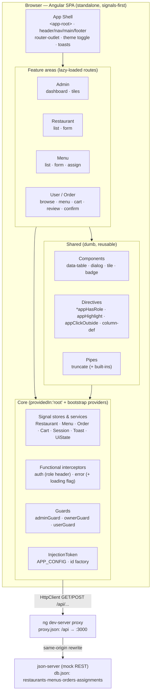
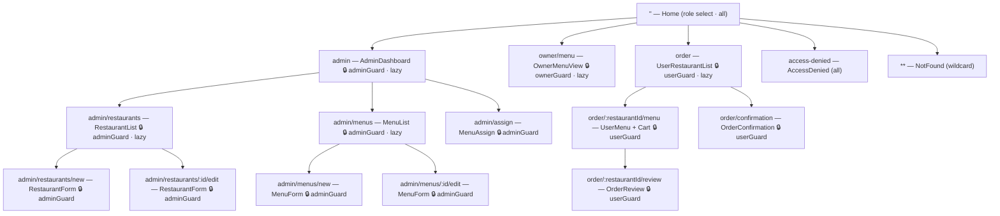
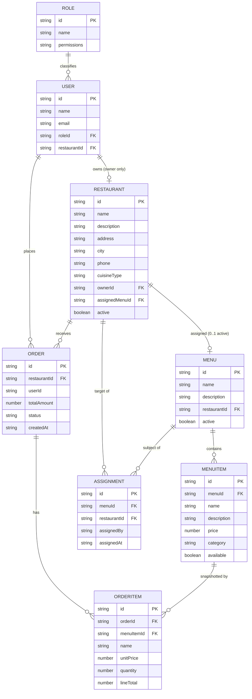
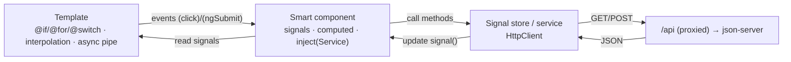
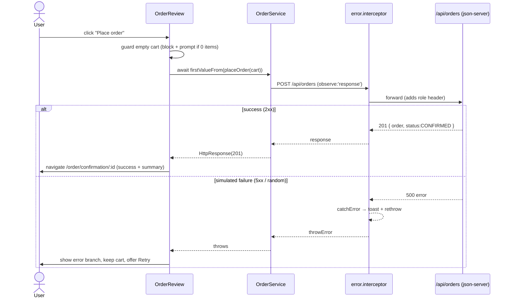

# Restaurant Chain Management — High-Level Design (HLD)

This document is the **High-Level Design** for a course-evaluation demo: a **frontend-only, Angular 17+ standalone, signals-first SPA** that manages a restaurant chain (Admin CRUD on restaurants/menus, menu-to-restaurant assignment, an owner read-only view, and an end-user ordering flow). Its purpose is to **prove mastery of two courses — _Angular Core Deep Dive_ and _Web Design (HTML/CSS/JS)_** — by making each architectural decision naturally exercise concepts those courses teach. It is intentionally a small, realistic app, **not** production software: no backend is written by us (a mock REST server stands in), and we deliberately avoid over-engineering.

> **Note on naming.** The assignment brief uses the labels "LDL/HDL"; the industry-standard terms are **HLD (High-Level Design)** and **LLD (Low-Level Design)**. This file is the **HLD** — the *what* and *why* at the architecture level. Its sibling **`LLD.md`** (Low-Level Design) covers the *how*: per-component signatures, form schemas, service method bodies, interceptor code, guard logic, and file-by-file structure. Cross-reference **`LLD.md`** for implementation detail whenever this document says "see the LLD".

Every decision below is stated as **WHAT** (the concept + technology used) and **WHY** (the requirement it satisfies **and** the course that taught it: `[Angular]` = Angular Core Deep Dive, `[Web]` = Web Design HTML/CSS/JS). Where a choice steps outside the two courses, it is explicitly flagged **[OUTSIDE 2 COURSES]**.

---

## 1. Purpose, Scope, and Constraints

### 1.1 Purpose
- **WHAT.** A single-page Angular application for restaurant-chain management with three actors (Admin, Restaurant Owner, User) and an ordering flow ending in a success/failure confirmation.
- **WHY.** The assignment requires exactly these modules and steps (CLI scaffold → components → routing → admin dashboard tiles → menu/restaurant CRUD → assign menu → user ordering flow). The app is the vehicle for demonstrating ~190 catalogued course concepts; features are chosen because they *naturally* pull those concepts in, not to pad a checklist.

### 1.2 Scope (in / out)

| In scope | Out of scope |
| --- | --- |
| Standalone Angular SPA (shell + 4 feature areas + core + shared) | Any backend **we** author for production |
| CRUD on Restaurants & Menus (admin), assignment, owner read-only view, user ordering | Real authentication / user accounts / passwords |
| Simulated role selection (no real auth) | Payments, real inventory, multi-tenant security |
| Mock REST persistence via **json-server** behind a **dev-server proxy** | Server-side rendering / hydration |
| Light/dark theming, responsive layout, a11y basics | Native mobile / PWA / offline sync |

### 1.3 Hard constraints (govern every decision)

| # | Constraint | How it shapes the design |
| --- | --- | --- |
| C1 | **Angular-only SPA, v17–22.** | Standalone components everywhere; `bootstrapApplication()`; no other UI framework. `[Angular]` |
| C2 | **Standalone, signals-first, modern control flow, `inject()`.** | No `NgModule`; state in `signal()/computed()/effect()`; templates use `@if/@for/@switch`; DI via `inject()`. `[Angular]` |
| C3 | **Prefer the two courses' concepts.** | CSS is hand-written (Grid/Flex/custom properties from `[Web]`); Angular features drawn from the deep dive. Anything else is flagged. |
| C4 | **Do not over-complicate.** | Simplest design that still exercises many concepts. In-memory/mock data, no state-management library, no micro-frontends. |
| C5 | **No contrived features.** | Every concept is hung off a feature that would exist anyway (a table needs `@for`; a form needs reactive forms; an order needs HTTP). |

**[OUTSIDE 2 COURSES] flags used in this doc:** `json-server` + `proxy.json` (a mock backend — necessary because the app must do real REST CRUD/ordering and neither course ships a server); a small number of modern Angular APIs (`httpResource`, zoneless CD, signal queries) that post-date parts of the deep dive but are the *direct signals-first evolution* of what it teaches. Optional Angular Material is **rejected** (see §10).

---

## 2. Actors & Roles

Three actors, selected in-app (no real auth — see F02). Roles drive **route guards**, a **custom structural directive** (`*appHasRole`), and an **HTTP interceptor** that stamps the active role on requests.

- **Admin** — full CRUD on Restaurants and Menus; assigns menus to restaurants; sees every list in editable mode.
- **Restaurant Owner** — read-only view of the menu(s) assigned to *their own* restaurant. No mutations.
- **User (end user)** — browses restaurants, views a chosen restaurant's menu, builds a cart, places an order, sees confirmation/error.

### 2.1 Permissions matrix

| Capability | Admin | Restaurant Owner | User |
| --- | :---: | :---: | :---: |
| Access admin dashboard (Menu / Restaurant tiles) | Yes | No | No |
| Create / Update / Delete **Restaurant** | Yes | No | No |
| View restaurant list | Yes (editable) | No | Yes (browse) |
| Create / Update / Delete **Menu** & items | Yes | No | No |
| View menu | Yes (editable) | Yes (read-only, own) | Yes (of chosen restaurant) |
| **Assign** menu → restaurant | Yes | No | No |
| Browse restaurants → order flow | No¹ | No¹ | Yes |
| Place order / see confirmation | No¹ | No¹ | Yes |

¹ Not their journey; the router redirects other actors away from the ordering routes and hides the controls. Enforced by guards + conditional UI (F13).

- **WHAT.** A capability matrix backed by `Role`/`User` entities and a `SessionService` signal for the active actor.
- **WHY.** F13 (role-based access control) requires that only admins mutate and that owners/users are constrained. The matrix is the single source of truth the guard and role directive both read. `[Angular]` (guards, DI) + `[Web]` (tables to present it).

---

## 3. High-Level Architecture

- **WHAT.** One standalone Angular app split into **Shell**, four **Feature areas** (Admin, Restaurant, Menu, User/Order), a **Core** layer (services, interceptors, guards, tokens), and a **Shared** layer (reusable UI components, pipes, directives). It talks to a **json-server** mock over `/api`, routed by the **Angular dev-server proxy** so there is no CORS in app code.
- **WHY.** Feature-area folders + a shared/core split keep a small app navigable without `NgModule`s (C2). The mock backend gives *free* real REST semantics so the app can demonstrate `HttpClient`, interceptors, and async data (`[Angular]`) without us writing server code (C4).



### Layer responsibilities

| Layer | Responsibility | Key course concepts | Course |
| --- | --- | --- | --- |
| **Shell** | `<app-root>` fills `<body>`; semantic `header/nav/main/footer`; `router-outlet`; theme toggle; toast host; responsive navbar. | Custom element selector, semantic HTML5, Flexbox navbar, `routerLink`/`routerLinkActive`. | `[Angular]` + `[Web]` |
| **Feature areas** | One folder per module; smart components own state via signals and call services; lazy-loaded via `loadComponent`. | Standalone components, signals, `@if/@for/@switch`, lazy routes, `@defer`. | `[Angular]` |
| **Core** | Singletons: signal-backed data stores, `HttpClient` access, functional interceptors, guards, `InjectionToken` config. | `@Injectable`, `inject()`, providers/recipes, interceptors, guards, tokens. | `[Angular]` |
| **Shared** | Presentational, reusable: content-projected `data-table`, `dialog`, `tile`, `badge`; attribute/structural directives; a custom pipe. | `@Input/@Output`, content projection, `ng-template`/`ngTemplateOutlet`, directives, pipes. | `[Angular]` |
| **Mock backend** | `json-server` serves real REST from one `db.json`; the dev proxy makes it same-origin `/api`. | `HttpClient`, "fetching data", dev-server proxy. | `[Web]` (fetch) + `[Angular]` (proxy) **[OUTSIDE 2 COURSES]** for the server itself |

---

## 4. Feature / Module Decomposition

The seven required build steps map to feature areas, components, routes, and roles as follows. (Feature IDs `F01–F13` match the requirements model and the traceability matrix.)

| Feature | Feature area | Key components | Route | Role(s) | WHAT + WHY (concept → course) |
| --- | --- | --- | --- | --- | --- |
| **F01 App structure & routing** | Shell | `AppComponent`, `NotFoundComponent` | `/` , `**` | all | Standalone shell + `provideRouter` with wildcard fallback. *Why:* assignment step 1/3 (structure + routing). `[Angular]` |
| **F02 Role selection (sim auth)** | Shell/Core | `HomeComponent`, `SessionService` | `''` | all | Landing page; a signal holds the active actor; no backend. *Why:* enables F13 without real auth (C4). `[Angular]` |
| **F03 Admin dashboard** | Admin | `AdminDashboardComponent`, `TileComponent` | `/admin` | Admin | Two Grid tiles → Menu / Restaurant; `@defer` for a heavy assign panel. *Why:* assignment step 4. `[Angular]` (defer, DI) + `[Web]` (CSS Grid tiles) |
| **F04 Restaurant CRUD** | Restaurant | `RestaurantListComponent`, `RestaurantFormComponent`, shared `data-table` | `admin/restaurants`, `admin/restaurants/new`, `admin/restaurants/:id/edit` | Admin | Table with Add/Edit/Delete + reactive form. *Why:* assignment step 6. `[Angular]` (reactive forms, `@for`) + `[Web]` (tables) |
| **F05 Menu CRUD** | Menu | `MenuListComponent`, `MenuFormComponent` (`FormArray` of items) | `admin/menus`, `admin/menus/new`, `admin/menus/:id/edit` | Admin | Menu table + nested item editor. *Why:* assignment step 5. `[Angular]` (`FormArray`, `valueChanges`) |
| **F06 Assign menu → restaurant** | Menu/Admin | `MenuAssignComponent` | `admin/assign` | Admin | Two selects (menu, restaurant) → save **two writes**: POST an `Assignment` **and** PATCH the menu's `restaurantId` so `?restaurantId=` lookups surface it. *Why:* assignment step 5 (assign section). `[Angular]` (forms, HTTP) |
| **F07 Owner menu view (read-only)** | Menu | `OwnerMenuViewComponent` | `owner/menu` | Owner | Assigned menu, no mutation controls (hidden via `*appHasRole`). *Why:* owner is read-only. `[Angular]` (structural directive) |
| **F08 Browse restaurants (user)** | User/Order | `UserRestaurantListComponent` | `order` | User | Responsive card grid + debounced search. *Why:* assignment step 7 entry. `[Web]` (auto-fit Grid) + `[Angular]` (RxJS debounce, `toSignal`) |
| **F09 View chosen menu** | User/Order | `UserMenuComponent` | `order/:restaurantId/menu` | User | Route id → `input()` signal → menu load. *Why:* step 7. `[Angular]` (signal inputs, `withComponentInputBinding`, `httpResource`) |
| **F10 Select items / cart** | User/Order | `CartComponent`, `CartService` (signal store) | `order/:restaurantId/menu` | User | Qty stepper (`model()`), running totals (`computed`). *Why:* step 7. `[Angular]` (signals) + `[Web]` (`reduce`) |
| **F11 Place order** | User/Order | `OrderReviewComponent`, `OrderService` | `order/:restaurantId/review` | User | POST `/api/orders`; success/fail branch. *Why:* step 7. `[Angular]` (HTTP POST, `observe:'response'`) + `[Web]` (`async/await`) |
| **F12 Order confirmation** | User/Order | `OrderConfirmationComponent` | `order/confirmation` | User | `@switch(status)` success/failed/pending; status passed via router navigation state; count-up animation. *Why:* step 7. `[Angular]` (`@switch`) + `[Web]` (`requestAnimationFrame`) |
| **F13 Role-based access control** | Core | `adminGuard`, `ownerGuard`, `userGuard`, `HasRoleDirective`, `auth.interceptor` | cross-cutting | all | Guards + conditional UI + role header; denied actors redirect to `access-denied`. *Why:* only admin mutates. `[Angular]` (guards, directive, interceptor) |

See **`LLD.md`** for each component's inputs/outputs, form controls, and service methods.

---

## 5. Routing Map

- **WHAT.** A single `provideRouter(routes)` tree with **lazy-loaded** feature chunks (`loadComponent`), **role guards** (`adminGuard` · `ownerGuard` · `userGuard`) on the management/owner/ordering branches, **route input binding** (`withComponentInputBinding()`) feeding `:restaurantId` straight into a signal `input()`, an `access-denied` redirect target for blocked guards, and a `**` wildcard to `NotFound`. The landing route `''` is the role-select `HomeComponent`.
- **WHY.** F01/F03 require routing across all modules; lazy loading keeps initial payload small and demonstrates `loadComponent` `[Angular]`; guards implement F13 and redirect denied actors to `access-denied`; the wildcard covers the "deep link to a missing id" edge case `[Web]` (client-side routing requires `http://`, not `file://`).



| Route | Component | Lazy? | Guard | Role | Notes |
| --- | --- | :---: | --- | --- | --- |
| `''` | `HomeComponent` | no | — | all | Role-select landing (F02). |
| `admin` | `AdminDashboardComponent` | **yes** | `adminGuard` | Admin | Two tiles. |
| `admin/restaurants` | `RestaurantListComponent` | **yes** | `adminGuard` | Admin | Table CRUD. |
| `admin/restaurants/new` | `RestaurantFormComponent` | yes | `adminGuard` | Admin | Add (reuses the edit form). |
| `admin/restaurants/:id/edit` | `RestaurantFormComponent` | yes | `adminGuard` | Admin | Edit. |
| `admin/menus` | `MenuListComponent` | **yes** | `adminGuard` | Admin | Table CRUD. |
| `admin/menus/new` | `MenuFormComponent` | yes | `adminGuard` | Admin | Add (`FormArray` of items). |
| `admin/menus/:id/edit` | `MenuFormComponent` | yes | `adminGuard` | Admin | Edit. |
| `admin/assign` | `MenuAssignComponent` | yes | `adminGuard` | Admin | Menu → restaurant. |
| `owner/menu` | `OwnerMenuViewComponent` | **yes** | `ownerGuard` | Owner | Read-only. |
| `order` | `UserRestaurantListComponent` | **yes** | `userGuard` | User | Browse. |
| `order/:restaurantId/menu` | `UserMenuComponent`+`Cart` | yes | `userGuard` | User | `:restaurantId` → `input()`. |
| `order/:restaurantId/review` | `OrderReviewComponent` | yes | `userGuard` | User | Place order. |
| `order/confirmation` | `OrderConfirmationComponent` | yes | `userGuard` | User | `@switch` on status (from router state). |
| `access-denied` | `AccessDeniedComponent` | no | — | all | Guard redirect target (F13). |
| `**` | `NotFoundComponent` | no | — | all | Deep-link fallback. |

---

## 6. Domain Data Model

- **WHAT.** Eight entities. A `Menu` **embeds** its `MenuItem`s as an `items: MenuItem[]` array (json-server stores them nested inside the menu document — one GET returns the menu with its items; there is no separate `menuItems` collection). A `Menu` is assigned to a `Restaurant` (one active menu per restaurant) — modelled *both* as a nullable `restaurantId` on the menu **and** an explicit `Assignment` record (audit of who/when). An `Order` likewise **embeds** its `OrderItem`s (`items: OrderItem[]`) snapshotting price/qty at order time. `User` carries a `roleId` and, for owners, a `restaurantId`.
- **WHY.** F04–F12 need these shapes; snapshotting order lines (rather than referencing live menu items) is standard so a later price/menu edit doesn't rewrite historical orders (also covers the "delete a menu that's assigned/ordered" edge cases). `[Web]` (objects/arrays as entities) + `[Angular]` (typed models power signals + reactive forms).



| Entity | Key fields | Relationships | Role in the app |
| --- | --- | --- | --- |
| **Restaurant** | `id, name, description, address, city, phone, cuisineType, ownerId, assignedMenuId, active` | owned by a `User`; 0..1 `Menu` | F04 CRUD; F08 browse. |
| **Menu** | `id, name, description, items[], restaurantId?, active` | **embeds** `MenuItem[]`; assigned to 0..1 `Restaurant` | F05 CRUD; F06 assign; F07/F09 view. |
| **MenuItem** | `id, menuId, name, description, price, category, available` | embedded array element inside `Menu.items` | F09/F10 selection. |
| **Assignment** | `id, menuId, restaurantId, assignedBy, assignedAt` | joins `Menu`↔`Restaurant` | F06 audit of assignment. |
| **Order** | `id, restaurantId, userId, items[], totalAmount, status, createdAt` | **embeds** `OrderItem[]` | F11/F12. `status ∈ PENDING|CONFIRMED|FAILED`. |
| **OrderItem** | `id, orderId, menuItemId, name, unitPrice, quantity, lineTotal` | embedded array element inside `Order.items` | Line snapshot at order time. |
| **User** | `id, name, email, roleId, restaurantId?` | has a `Role`; may own a `Restaurant` | F02 actor identity. |
| **Role** | `id, name(Admin\|RestaurantOwner\|User), permissions` | classifies `User` | F13 permission source. |

---

## 7. State & Data Flow

- **WHAT.** **Signals-first stores** (`RestaurantService`, `MenuService`, `CartService`, `OrderService`, `SessionService`) hold state in `signal()`; derived values use `computed()`; side effects (localStorage cart persistence, redirect timers) use `effect()`. Services fetch/persist through `HttpClient` to `/api`. Templates prefer signals, with the **async pipe** used where an `Observable` is more natural (e.g. an order list stream). Change detection is **zoneless + OnPush** so signal reads drive updates.
- **WHY.** C2 mandates signals-first; the deep dive teaches `signal/computed/effect`, signal inputs, `toSignal/toObservable`, and the async pipe. Keeping state in root services (no external store lib) honours C4. `[Angular]` throughout; `[Web]` for the `reduce`/`map`/`filter` inside computeds and `JSON.stringify/parse` for persistence.

### 7.1 Store pattern (illustrative — full code in LLD)

```typescript
@Injectable()   // NO providedIn — listed in the ordering route's providers to scope a private cart
export class CartService {
  private readonly _items = signal<CartItem[]>([]);                // CartItem = { item: MenuItem; qty: number }
  readonly items = this._items.asReadonly();                       // read-only outward
  readonly count = computed(() => this._items().reduce((n, i) => n + i.qty, 0));
  readonly total = computed(() => this._items().reduce((s, i) => s + i.item.price * i.qty, 0));

  constructor() {
    // effect(): persist on every change; replace-never-mutate keeps signals correct
    effect(() => localStorage.setItem('cart', JSON.stringify(this._items())));
  }
  setQty(id: string, qty: number) {
    this._items.update(list => list.map(i => i.item.id === id ? { ...i, qty } : i)); // new refs
  }
}
```

> `CartService` is **route-scoped** (bare `@Injectable()`, listed in the ordering route's `providers`) so each visit to the ordering flow gets a private cart — a **hierarchical-injection** demonstration (`[Angular]`). See the full implementation in `LLD.md` §10.

### 7.2 Data-flow overview



### 7.3 Place-order sequence (success **and** failure — F11/F12)

- **WHAT.** `OrderReview` calls `OrderService.placeOrder()` (a cold `Observable<HttpResponse<Order>>`), awaited via `firstValueFrom` in an `async/await` handler with `try/catch/finally`. Response status routes to confirmation; an error (simulated failure) shows the error branch **without clearing the cart** (retry).
- **WHY.** F11 requires success/failure branching and F12 requires a retry that keeps the cart. `observe:'response'` exposes the status code; the global error interceptor centralises logging/toasts. `[Angular]` (HTTP, interceptors, `observe:'response'`) + `[Web]` (`async/await`, `try/catch/finally`).



---

## 8. Backend Simulation

No backend is written by us. Both options below make the Angular app call **same-origin `/api/...`** so there is **no CORS handling in app code** — the browser and app treat the mock as part of the same site. The mechanism that achieves this is the **Angular dev-server proxy**.

### 8.1 The dev-server proxy concept (applies to BOTH options)

- **WHAT.** `ng serve` runs a webpack/esbuild dev server. A `proxy.json` tells it: any request whose path starts with `/api` should be transparently forwarded to another origin (the mock server), rewriting `/api` off the path. The Angular code only ever sees relative `/api/...` URLs.
- **WHY.** The deep dive teaches this exact pattern to avoid CORS in development. It keeps `HttpClient` calls origin-agnostic and swappable (change one file to point at a different backend). `[Angular]`

```json
// proxy.json  — map same-origin /api → the mock server
{ "/api": { "target": "http://localhost:3000", "secure": false, "pathRewrite": { "^/api": "" } } }
```

```typescript
// In services, URLs stay relative — the proxy does the rest:
this.http.get<Restaurant[]>('/api/restaurants');
this.http.get<Menu[]>('/api/menus', { params: new HttpParams().set('restaurantId', id) });
```

### 8.2 PRIMARY: json-server + proxy (chosen)

- **WHAT.** One `db.json` gives **free real REST**: list, get-by-id, POST, PUT, PATCH, DELETE, and query filtering — zero server code written. Two processes run in dev (`server` + `start`).
- **WHY.** Simplest path to genuine HTTP semantics so the app can demonstrate `HttpClient`, `HttpParams` filtering, `observe:'response'`, interceptors, and `async` data (`[Angular]`) — satisfying C4 (least effort) and the "fetching data" concept (`[Web]`). **[OUTSIDE 2 COURSES]** — `json-server` is a dev dependency, justified because the two courses provide no server and the ordering/CRUD requirements need one.

```json
// db.json — top-level keys become REST collections automatically
{
  "restaurants": [{ "id": "1", "name": "Bistro One", "city": "Pune", "assignedMenuId": "10", "active": true }],
  "menus":       [{ "id": "10", "name": "Lunch", "restaurantId": "1", "active": true,
                    "items": [{ "id": "100", "menuId": "10", "name": "Paneer Tikka",
                                "price": 240, "available": true }] }],
  "orders":      [],
  "assignments": []
}
```

**Endpoints (auto-generated by json-server):**

| Method | Path (app calls `/api/...`) | Purpose | Feature |
| --- | --- | --- | --- |
| GET | `/restaurants` · `/restaurants/:id` | List / detail | F04, F08 |
| POST · PUT · PATCH · DELETE | `/restaurants[/:id]` | Restaurant CRUD | F04 |
| GET | `/menus?restaurantId=1` | Menu(s) for a restaurant (filter) | F07, F09 |
| POST · PUT · PATCH · DELETE | `/menus[/:id]` | Menu CRUD; assign PATCHes `restaurantId` | F05, F06 |
| GET · POST · DELETE | `/assignments` | Assign / reassign menu (audit record) | F06 |
| POST | `/orders` | Place order (returns 201) | F11 |

**F12 confirmation.** There is **no** confirmation-lookup GET: `OrderReview` places the order and navigates to `order/confirmation` carrying the outcome in **router navigation state** (`{ status }`); `OrderConfirmation` reads that state and `@switch`es on it. This keeps the flow to a single POST (see `LLD.md` §14).

```jsonc
// package.json scripts — two processes in dev
{
  "scripts": {
    "server": "json-server --watch db.json --port 3000",
    "start":  "ng serve --proxy-config proxy.json"
  }
}
```

**"Order sometimes fails" requirement.** Two simple options: (a) a tiny json-server **custom middleware** that returns HTTP 500 for a fraction of `POST /orders` (server-side, most faithful to a flaky API); or (b) **client-side simulation** — `OrderService` randomly throws before/after the POST. Either satisfies F11's failure branch; the LLD picks one and shows the ~10-line snippet.

### 8.3 ALTERNATIVE (appendix): hand-written Express + proxy

- **WHAT.** Mirror the reference deep-dive project (`angular-university/angular-course`): a `server.ts` (Express + `cors` + `body-parser`) on port `9000`, one route file per operation, an in-memory `db-data.ts`, and the **same** `proxy.json` (retargeted to `:9000`). ~150 lines of server code.
- **WHY.** Faithful to *exactly* what the deep dive demonstrates (you write the endpoints), at the cost of more code to maintain — offered as the "if you want to mirror the course precisely" option. **[OUTSIDE 2 COURSES]** (Express). Still no CORS in app code because the proxy fronts it identically.

```typescript
// server.ts (sketch) — Express mock the course-faithful way
import express from 'express';
const app = express();
app.use(express.json());
app.get('/api/restaurants', (_req, res) => res.json(DB.restaurants));
app.post('/api/orders', (req, res) => { /* build order; ~10% → res.status(500) */ });
app.listen(9000, () => console.log('mock API on :9000'));
```

**Recommendation.** Ship **PRIMARY (json-server)** for the eval (least code, C4); keep this appendix as documentation of the course-faithful variant.

---

## 9. Cross-Cutting Concerns

| Concern | WHAT | WHY (requirement + course) |
| --- | --- | --- |
| **Theming (light/dark)** | CSS **custom properties** (`--bg`, `--text`, `--accent`) defined at `:root` and overridden under a `.theme-dark` class toggled by a `menuOpen`/`theme` signal; components use `:host` and `:host-context(.theme-dark)`. | Requirement: usable in both modes. Custom properties, cascade, and `:host-context` come straight from `[Web]` (colors/variables) + `[Angular]` (view encapsulation). |
| **HTTP interceptors** | **Two** functional interceptors registered via `provideHttpClient(withInterceptors([...]))`: **auth** stamps the active role header; **error** centralises `catchError` → toast **and** flips a global loading signal on a `UiStateService` (set on request, cleared in `finalize`). | F13 (role on requests) + global UX. Interceptors + functional DI are core deep-dive material. `[Angular]` |
| **Change detection** | **Zoneless** (`provideZonelessChangeDetection()`) + **OnPush** on every component; signals mark views dirty automatically. | C2 signals-first; zoneless is the signals-native CD model. `[Angular]` **[OUTSIDE 2 COURSES]** for zoneless specifically (a newer API — the direct evolution of OnPush the course teaches; **requires Angular v18+**, so the low end of the v17–22 range would fall back to OnPush + zone.js). |
| **Guards & role directive** | `adminGuard`/`ownerGuard`/`userGuard` (`CanActivateFn`) inject `SessionService` and return `true` or a `UrlTree` redirect to `access-denied`; `*appHasRole` structural directive hides mutation controls per role. | F13 access control. Functional guards + custom structural directives are deep-dive topics. `[Angular]` |
| **Accessibility** | Semantic `header/nav/main/footer`; `<table>` with `<caption>`/`th[scope]`; ``; `[attr.aria-disabled]`/`aria-live` on toasts; visible focus states; `@ViewChild`-focused first dialog input. | Usability + demonstrates attribute-vs-property binding and DOM-attr concepts. `[Web]` (semantics, alt) + `[Angular]` (`attr.` binding, view queries). |
| **Responsive layout** | Mobile-first base styles; `@media` `min-width` breakpoints; **Flexbox** navbar/toolbars; **CSS Grid** dashboard tiles and `repeat(auto-fit, minmax())` restaurant cards; hamburger toggled by a signal. | Requirement: works on phone → desktop. All four (`@media`, mobile-first, Flexbox, Grid, auto-fit) are `[Web]` capstone topics. |
| **Notifications** | `ToastService` uses a `Subject`/`BehaviorSubject`, exposes `toast$ = subject.asObservable()`, consumed via async pipe. | Cross-cutting feedback (order placed, permission denied). Subjects + `asObservable()` are deep-dive RxJS. `[Angular]` |

---

## 10. Tech Stack & Tooling

| Area | Choice | WHAT + WHY | Course |
| --- | --- | --- | --- |
| Framework | **Angular 17–22, standalone, signals-first** | C1/C2. `bootstrapApplication()`, no `NgModule`. | `[Angular]` |
| Scaffold / dev | **Angular CLI** (`ng new`, `ng serve`) | Assignment step 1; hot-reload dev server. | `[Angular]` |
| Language | **TypeScript** | Typed models power signals + reactive forms. | `[Angular]`/`[Web]` |
| Styling | **Hand-written CSS/SCSS** — custom properties, Grid, Flexbox, `@media`; SCSS partials (`_variables`, `_theme`) | C3: prefer `[Web]` CSS over a component library; proves layout/theming skill. | `[Web]` |
| HTTP | **`HttpClient`** + functional interceptors | Real REST to `/api`; "fetching data". | `[Angular]` + `[Web]` |
| Mock backend | **json-server** (primary) / **Express** (appendix) | §8. Free REST, zero/low server code. **[OUTSIDE 2 COURSES]** — necessary; no server in either course. | — |
| Dev proxy | **`proxy.json`** | Same-origin `/api`, no CORS in app. | `[Angular]` |
| Testing | **TestBed + ComponentFixture** (a couple of specs: cart totals, data-table rendering) | Demonstrates component/service testing without full coverage (C4). | `[Angular]` |
| Deploy (optional) | **`ng build` → GitHub Pages** | Static SPA hosting; client-side routing needs `http://` not `file://`. | `[Web]` |

**Angular Material — REJECTED.** Considered for tables/dialogs, but it is **[OUTSIDE 2 COURSES]** and would *hide* the very `[Web]` CSS skills (Grid, Flex, custom properties, tables) and `[Angular]` content-projection skills the eval must show. Building a small `data-table`/`dialog` ourselves is more instructive and keeps the dependency surface minimal (C4).

---

## 11. Concept-Coverage Summary

Rolled up from the traceability matrix (`~190` concepts). Each course area maps to where it is demonstrated; per-concept WHAT+WHY detail lives in the matrix and the **`LLD.md`**.

| Course area | Demonstrated in (feature → artifact) |
| --- | --- |
| **[Angular] Components & templates** | Standalone components (all), interpolation (cart), `@if/@for/@switch` (lists, user-menu, confirmation), `[ngClass]/[ngStyle]/[class.x]` (data-table, menu), `<ng-container>`, `@let`, `as` alias, built-in pipes. |
| **[Angular] Inputs/Outputs & queries** | `@Input/@Output+EventEmitter` (data-table, badge), signal `input()/model()` (user-menu, cart), `viewChild/contentChildren` (dialog, data-table), `@ViewChild` focus (dialog). |
| **[Angular] Content projection** | `<ng-content>` single/multi-slot (dialog), `ng-template`/`ngTemplateOutlet`/`ColumnDefDirective` context (data-table). |
| **[Angular] Directives** | Attribute (`appHighlight` + `Renderer2`, `@HostBinding/@HostListener`), `appClickOutside`, **custom structural** `*appHasRole`, a directive reading its own host `TemplateRef` via `inject()` (`ColumnDefDirective`). |
| **[Angular] DI** | `inject()`, `providedIn:'root'`, provider recipes (`useValue/useFactory`), `InjectionToken` (`APP_CONFIG`), hierarchical (cart scoped to order route). |
| **[Angular] Signals & RxJS** | `signal/computed/effect`, `asReadonly`, replace-never-mutate, `toSignal/toObservable`, `debounceTime/switchMap`, `Subject/asObservable`, `takeUntilDestroyed`, async pipe. |
| **[Angular] Forms** | Reactive `FormBuilder.group` + `Validators` (restaurant), `FormArray`+`valueChanges` (menu), control-state flags; template-driven `[(ngModel)]` (search). |
| **[Angular] Routing** | `provideRouter`, `loadComponent` lazy, `routerLink/routerLinkActive`, `withComponentInputBinding`, `**` wildcard, guards. |
| **[Angular] HTTP** | `provideHttpClient(withInterceptors)`, `HttpParams`, `observe:'response'`, `shareReplay(1)`, `httpResource`, interceptors. |
| **[Angular] Perf / CD** | OnPush everywhere, zoneless CD, `@defer` (+ `@placeholder/@loading/@error`, triggers, prefetch). |
| **[Angular] Encapsulation & pipes** | `:host`, `:host-context`, emulated scoping; custom `TruncatePipe` (pure). |
| **[Angular] i18n / testing** | `i18n` attribute + ICU plural (cart); TestBed specs (cart, data-table). |
| **[Web] HTML** | Document skeleton + meta/viewport (index.html), semantic regions, tables (`caption`, `th`, spans), lists (`ul/dl`), images `alt`, entities, void tags, `<a>`/links. |
| **[Web] CSS** | Three ways to add CSS, selectors/specificity/cascade, combinators, pseudo-classes/elements, box model, typography/fonts (`display=swap`), color tokens, transitions/shadow. |
| **[Web] Layout** | Flexbox navbar/footer, CSS Grid tiles, responsive `auto-fit` cards, `@media` mobile-first, sticky/fixed positioning. |
| **[Web] JavaScript** | `const/let`, template literals, operators, objects/arrays, `map/filter/reduce/find/some/every`, closures (id factory), debounce, `structuredClone`, `JSON` parse/stringify, `async/await` + `try/catch/finally`, `switch`, events/`preventDefault`, delegation, `requestAnimationFrame`. |

---

## 12. Non-Functional Notes & Explicit Simplifications

These are **deliberate** simplifications so the app stays a small, honest course demo (C4/C5), each with its rationale.

| Simplification | Why it's acceptable here |
| --- | --- |
| **No real authentication** — actor chosen in-app (F02). | Auth isn't a course topic; roles exist only to demonstrate guards + the role directive (F13). A real login server is out of scope. |
| **Mock backend, not a real API.** | The eval is about the *frontend*. json-server gives real REST semantics for `HttpClient` demos without server code we'd have to secure/maintain. |
| **No state-management library (NgRx, etc.).** | Signals + root services fully cover this app's state; adding a store would be over-engineering (C4) and is **[OUTSIDE 2 COURSES]**. |
| **In-memory / single `db.json`; no migrations or real DB.** | Data volume is tiny; persistence is a demo convenience, not a requirement. |
| **Partial test coverage (a few specs), not full TDD.** | Enough to demonstrate TestBed/ComponentFixture; exhaustive testing isn't the eval's goal. |
| **No SSR/hydration, PWA, or i18n build pipeline.** | Client-only SPA; a single `i18n` attribute + ICU plural demonstrates the concept without a localization build. |
| **Security is nominal (client-side role gating only).** | Guards/interceptor headers are illustrative; a mock backend can't enforce real authorization, and that's fine for a non-production demo. |
| **Optimistic simplicity on referential edges** (delete a menu that's assigned, reassign an already-assigned menu). | Handled with a warn/clear-assignment prompt rather than transactional integrity — enough to demonstrate the edge case (empty states, dangling assignment) without a rules engine. |
| **Accessibility is basic** (semantics, alt, focus, aria-live), not a full WCAG audit. | Demonstrates the `[Web]` semantic/a11y concepts the course covers, proportionate to a demo. |

**Performance posture.** Lazy routes + `@defer` keep the initial bundle small; OnPush + zoneless + signals avoid needless change detection; `shareReplay(1)` caches seed GETs. These are demonstrations of course techniques, not a hard SLA.

---

*End of HLD. For implementation-level detail — component APIs, form schemas, service/interceptor/guard code, folder layout, and the exact "order fails" middleware — see the sibling **`LLD.md`** (Low-Level Design).*
