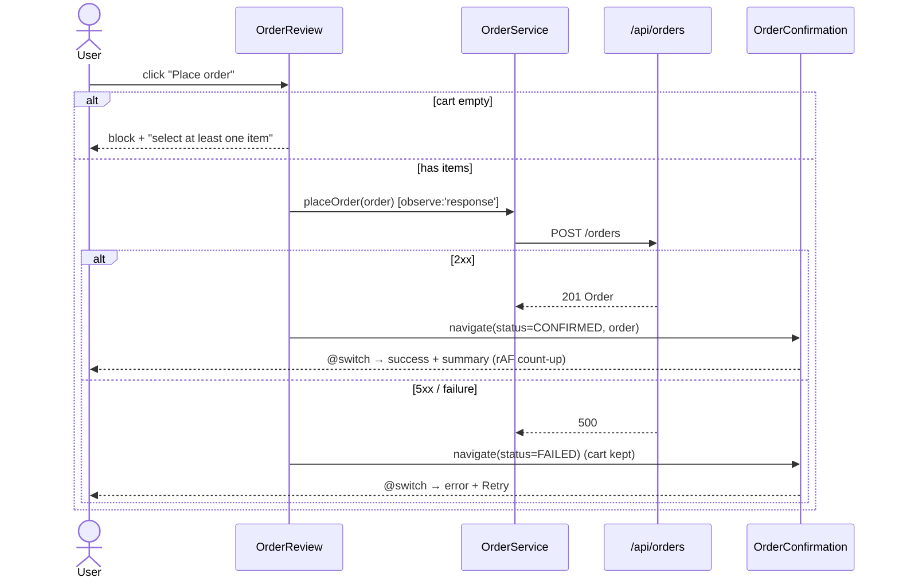

# Low-Level Design (LLD) — Restaurant Chain Management (Angular)

This document is the **Low-Level Design (LLD)** for the *Restaurant Chain Management* case study: a
**frontend-only, Angular 17+ standalone, signals-first** single-page application built to prove hands-on
mastery of two courses — **Angular Core Deep Dive** and **Web Design (HTML/CSS/JS)**. It is a small,
realistic course-evaluation demo (Admin CRUD on restaurants/menus, menu-to-restaurant assignment, an
owner read-only view, and a user browse → menu → cart → order → confirmation flow), backed by a
zero-code mock REST API (`json-server` behind the Angular dev-server proxy). This is **not** production
software; the design deliberately favours the *simplest* structure that still naturally exercises a wide
range of course concepts, rather than inventing features to shoehorn concepts in.

> **Naming note.** The assignment loosely calls these "LDL / HDL" documents. They are written here using
> the standard industry terms: **HLD (High-Level Design)** and **LLD (Low-Level Design)**. This file is the
> LLD. Its sibling, **`HLD.md`**, covers the system context, actor/role model, feature catalogue, screen
> map and high-level architecture; this LLD drills into the implementation-level detail (folders, routes,
> models, services, signals, forms, CSS, the backend contract and testing). Where the HLD says *what and
> why at a system level*, the LLD says *how, file by file*.

Every design decision below is stated as **WHAT** (which concept/technology) and **WHY** (which
requirement it satisfies and which course taught it). The course tags used throughout are
**[ACDD]** = Angular Core Deep Dive and **[WEB]** = Web Design (HTML/CSS/JS).

---

## Table of contents

1. [Project & folder structure](#1-project--folder-structure)
2. [Routing table](#2-routing-table)
3. [Domain models / interfaces](#3-domain-models--interfaces)
4. [Services (signal-based state + HttpClient)](#4-services-signal-based-state--httpclient)
5. [HTTP interceptors](#5-http-interceptors)
6. [Guards & resolvers](#6-guards--resolvers)
7. [Per-component design](#7-per-component-design)
8. [Reusable / shared UI](#8-reusable--shared-ui)
9. [Custom pipes & directives](#9-custom-pipes--directives)
10. [Signals state design](#10-signals-state-design)
11. [Forms detail](#11-forms-detail)
12. [CSS / SCSS architecture](#12-css--scss-architecture)
13. [Backend contract (json-server + proxy)](#13-backend-contract-json-server--proxy)
14. [Order flow: error & confirmation handling](#14-order-flow-error--confirmation-handling)
15. [Testing approach](#15-testing-approach)
16. [Concept-coverage traceability matrix](#16-concept-coverage-traceability-matrix)

---

## 1. Project & folder structure

**WHAT.** A single standalone Angular application scaffolded with the CLI (`ng new`, `ng serve`),
organised into `core/` (app-wide singletons, guards, interceptors, models, tokens), `shared/` (reusable
presentational components, directives, pipes) and `features/` (one folder per module: `admin`,
`restaurants`, `menus`, `order`). Bootstrapped via `bootstrapApplication(AppComponent, appConfig)` — **no
NgModules**.

**WHY.** The assignment's **step 1** ("create app structure via Angular CLI") and **step 2** ("components:
Admin, Menu, Restaurant, User") map directly to feature folders. A `core`/`shared`/`features` split is the
standard standalone layout taught in **[ACDD]** ("Standalone components", "Migrate to standalone",
"Feature & shared *folders* replace modules") and keeps the demo navigable without the ceremony of
`@NgModule`.

```text
restaurant-chain/
├─ src/
│  ├─ index.html                      # [WEB] document skeleton, <meta> viewport, font <link>, <app-root>
│  ├─ main.ts                         # bootstrapApplication(AppComponent, appConfig)  [ACDD]
│  ├─ styles.scss                     # global tokens + resets (imports SCSS partials) [WEB]
│  ├─ styles/
│  │  ├─ _variables.scss              # color/space/type tokens (custom properties)     [WEB]
│  │  └─ _theme.scss                  # light/dark theme map                            [WEB]
│  └─ app/
│     ├─ app.component.{ts,html,scss} # shell: header/nav/main/footer, routerLink       [ACDD/WEB]
│     ├─ app.config.ts                # providers: router, http, interceptors, tokens   [ACDD]
│     ├─ app.routes.ts                # route table, lazy loadComponent, guards         [ACDD]
│     ├─ core/
│     │  ├─ models/                   # domain interfaces & enums (see §3)
│     │  │  └─ models.ts
│     │  ├─ tokens/
│     │  │  ├─ app-config.token.ts    # InjectionToken<AppConfig>                        [ACDD]
│     │  │  └─ id.factory.ts          # closure counter useFactory recipe          [WEB/ACDD]
│     │  ├─ services/
│     │  │  ├─ restaurant.service.ts  # signal store + HttpClient GET seed             [ACDD]
│     │  │  ├─ menu.service.ts        # httpResource-based menu load                   [ACDD]
│     │  │  ├─ order.service.ts       # POST /api/orders, observe:'response'           [ACDD]
│     │  │  ├─ cart.service.ts        # writable signal + computed totals + effect     [ACDD]
│     │  │  ├─ session.service.ts     # current role/user signal (simulated auth)      [ACDD]
│     │  │  ├─ toast.service.ts       # Subject<Toast> notifications                    [ACDD]
│     │  │  └─ ui-state.service.ts    # global loading signal (used by errorInterceptor)[ACDD]
│     │  ├─ interceptors/
│     │  │  ├─ auth.interceptor.ts    # adds X-Role header, console logging            [ACDD/WEB]
│     │  │  └─ error.interceptor.ts   # global catchError + loading flag               [ACDD]
│     │  └─ guards/
│     │     ├─ admin.guard.ts         # CanActivateFn role check via inject()          [ACDD]
│     │     ├─ owner.guard.ts         # owner-only route guard                          [ACDD]
│     │     └─ user.guard.ts          # user-only route guard (ordering flow)           [ACDD]
│     ├─ shared/
│     │  ├─ data-table/               # generic table: content projection + col defs   [ACDD]
│     │  │  ├─ data-table.component.ts
│     │  │  └─ column-def.directive.ts
│     │  ├─ tile/tile.component.ts    # dashboard tile (:host styling)                  [ACDD/WEB]
│     │  ├─ dialog/dialog.component.ts# ConfirmDialog: multi-slot ng-content            [ACDD]
│     │  ├─ badge/badge.component.ts  # presentational @Input badge                     [ACDD]
│     │  ├─ directives/
│     │  │  ├─ has-role.directive.ts  # *appHasRole structural directive               [ACDD]
│     │  │  ├─ highlight.directive.ts # [appHighlight] attribute directive (Renderer2)  [ACDD]
│     │  │  └─ click-outside.directive.ts
│     │  └─ pipes/
│     │     └─ truncate.pipe.ts       # pure @Pipe                                       [ACDD]
│     └─ features/
│        ├─ admin/
│        │  └─ admin-dashboard.component.{ts,html,scss}   # F03 two tiles + @defer
│        ├─ restaurants/
│        │  ├─ restaurant-list.component.{ts,html,scss}   # F04 table CRUD
│        │  └─ restaurant-form.component.{ts,html,scss}   # F04 reactive form
│        ├─ menus/
│        │  ├─ menu-list.component.{ts,html,scss}         # F05 table CRUD
│        │  ├─ menu-form.component.{ts,html,scss}         # F05 FormArray of items
│        │  ├─ menu-assign.component.{ts,html,scss}       # F06 assign menu→restaurant
│        │  └─ owner-menu-view.component.{ts,html,scss}   # F07 read-only
│        └─ order/
│           ├─ user-restaurant-list.component.{ts,html}   # F08 browse + search
│           ├─ user-menu.component.{ts,html,scss}         # F09/F10 menu + select
│           ├─ cart.component.{ts,html,scss}              # F10 cart, model() qty
│           ├─ order-review.component.{ts,html}           # F11 place order
│           └─ order-confirmation.component.{ts,html}     # F12 success/error
├─ db.json                            # json-server data (restaurants/menus/orders)
├─ proxy.json                         # /api → http://localhost:3000                    [ACDD]
└─ package.json                       # "server" + "start" npm scripts
```

**`app.config.ts`** (WHAT: single provider array; WHY: standalone bootstrap replaces `@NgModule`
providers — **[ACDD]** "Providers & tokens", "Provider recipes", zoneless CD):

```ts
export const appConfig: ApplicationConfig = {
  providers: [
    provideZonelessChangeDetection(),                       // [ACDD] zoneless (stable, v20+): signals drive CD
    provideRouter(routes, withComponentInputBinding()),     // [ACDD] route param → input() signal
    provideHttpClient(withInterceptors([authInterceptor, errorInterceptor])), // [ACDD]
    { provide: APP_CONFIG, useValue: { appName: 'RestoChain',
        mockApiUrl: '/api', currencyCode: 'USD' } },        // [ACDD] useValue recipe
    { provide: ID_GEN, useFactory: createIdGenerator },     // [ACDD] useFactory recipe (closure)
  ],
};
```

---

## 2. Routing table

**WHAT.** A flat route table with **lazy `loadComponent`** for heavy feature chunks, functional
`canActivate` guards, and a `**` wildcard to a NotFound page. Route params bind straight to component
signal inputs via `withComponentInputBinding()`.

**WHY.** Assignment **step 3** ("implement routing") and **F01/F13**. Lazy loading, wildcard fallback,
`routerLink`/`routerLinkActive`, and input-binding are all **[ACDD]** router topics ("provideRouter",
"loadComponent lazy-loading", "withComponentInputBinding"). Client-side routing only works over `http://`
(via `ng serve`), not `file://` — a **[WEB]** deployment gotcha.

| Path | Component | Lazy? | Guard / Resolver | Role |
|---|---|---|---|---|
| `''` | `HomeComponent` (role-select landing) | no | — | all (F02) |
| `admin` | `AdminDashboardComponent` | `loadComponent` | `adminGuard` | Admin (F03) |
| `admin/restaurants` | `RestaurantListComponent` | `loadComponent` | `adminGuard` | Admin (F04) |
| `admin/restaurants/new` | `RestaurantFormComponent` | `loadComponent` | `adminGuard` | Admin (F04) |
| `admin/restaurants/:id/edit` | `RestaurantFormComponent` | `loadComponent` | `adminGuard` | Admin (F04) |
| `admin/menus` | `MenuListComponent` | `loadComponent` | `adminGuard` | Admin (F05) |
| `admin/menus/new` | `MenuFormComponent` | `loadComponent` | `adminGuard` | Admin (F05) |
| `admin/menus/:id/edit` | `MenuFormComponent` | `loadComponent` | `adminGuard` | Admin (F05) |
| `admin/assign` | `MenuAssignComponent` | `loadComponent` | `adminGuard` | Admin (F06) |
| `owner/menu` | `OwnerMenuViewComponent` | `loadComponent` | `ownerGuard` | Owner (F07) |
| `order` | `UserRestaurantListComponent` | `loadComponent` | `userGuard` | User (F08) |
| `order/:restaurantId/menu` | `UserMenuComponent` | `loadComponent` | `userGuard` + `menuResolver` (optional) | User (F09/F10) |
| `order/:restaurantId/review` | `OrderReviewComponent` | `loadComponent` | `userGuard` | User (F11) |
| `order/confirmation` | `OrderConfirmationComponent` | `loadComponent` | `userGuard` | User (F12) |
| `access-denied` | `AccessDeniedComponent` | no | — | all (F13) |
| `**` | `NotFoundComponent` | no | — | all (F01) |

```ts
// app.routes.ts  — [ACDD] loadComponent + guard + wildcard
export const routes: Routes = [
  { path: '', component: HomeComponent, title: 'RestoChain' },
  {
    path: 'admin',
    canActivate: [adminGuard],
    loadComponent: () => import('./features/admin/admin-dashboard.component')
      .then(m => m.AdminDashboardComponent),
  },
  {
    path: 'order/:restaurantId/menu',
    canActivate: [userGuard],
    providers: [CartService],            // [ACDD] route-scoped provider → private cart (hierarchical DI)
    loadComponent: () => import('./features/order/user-menu.component')
      .then(m => m.UserMenuComponent),   // :restaurantId auto-binds to input() below
  },
  { path: 'access-denied', component: AccessDeniedComponent },
  { path: '**', component: NotFoundComponent },
];
```

Topnav links use `routerLink` + `routerLinkActive` for the active highlight (**[ACDD]**), and an external
repo link uses `<a target="_blank" rel="noopener">` (**[WEB]** "Links & anchor tag").

---

## 3. Domain models / interfaces

**WHAT.** Plain TypeScript `interface`s and a `Role` enum in `core/models/models.ts` — the strongly-typed
shape of every entity that crosses a service or template.

**WHY.** Static typing replaces runtime `typeof` checks (**[WEB]** "Data types" — consciously superseded).
Entities/objects/arrays are **[WEB]** JS fundamentals ("Objects", "Arrays"); modelling them as interfaces
is the **[ACDD]** "Model vs View" separation feeding the CRUD tables (F04/F05) and order flow (F10–F12).

```ts
export enum Role { Admin = 'Admin', Owner = 'RestaurantOwner', User = 'User' }

export interface Restaurant {
  id: string; name: string; description: string; address: string; city: string;
  phone: string; cuisineType: string;
  ownerId: string | null; assignedMenuId: string | null; active: boolean;
}

export interface MenuItem {
  id: string; menuId: string; name: string; description: string;
  price: number; category: string; available: boolean;
}
export interface Menu {
  id: string; name: string; description: string;
  items: MenuItem[]; restaurantId: string | null; active: boolean;
}

export interface Assignment {
  id: string; menuId: string; restaurantId: string;
  assignedBy: string; assignedAt: string;   // ISO date
}

export type OrderStatus = 'PENDING' | 'CONFIRMED' | 'FAILED';
export interface OrderItem {
  id: string; orderId: string; menuItemId: string;
  name: string; unitPrice: number; quantity: number; lineTotal: number;
}
export interface Order {
  id: string; restaurantId: string; userId: string;
  items: OrderItem[]; totalAmount: number; status: OrderStatus; createdAt: string;
}

export interface User {
  id: string; name: string; email: string; roleId: Role; restaurantId: string | null;
}
export interface AppConfig { appName: string; mockApiUrl: string; currencyCode: string; }
export interface CartItem { item: MenuItem; qty: number; }
```

---

## 4. Services (signal-based state + HttpClient)

**WHAT.** `providedIn: 'root'` singletons hold state in **writable signals** and expose it read-only;
mutators call the mock API through `HttpClient` at `/api/...`. Components read the signals directly
(no manual subscriptions).

**WHY.** **[ACDD]** "@Injectable service", "Signal-based data services", "Tree-shakeable providedIn:'root'",
"How DI works / inject()". Signals give OnPush + zoneless components automatic, glitch-free updates without
`markForCheck()`. The user-facing seed load uses `HttpClient` GET — Angular's equivalent of the **[WEB]**
"Fetching data" lesson.

### RestaurantService (full-ish snippet)

```ts
@Injectable({ providedIn: 'root' })
export class RestaurantService {
  private http = inject(HttpClient);                       // [ACDD] inject()
  private cfg = inject(APP_CONFIG);                        // [ACDD] InjectionToken
  private base = `${this.cfg.mockApiUrl}/restaurants`;     // [WEB] template literal

  private _restaurants = signal<Restaurant[]>([]);         // [ACDD] writable signal
  readonly restaurants = this._restaurants.asReadonly();   // [ACDD] asReadonly()
  readonly count = computed(() => this._restaurants().length); // [ACDD] computed()

  // unfiltered seed load, cached so repeat calls share one HTTP request  [ACDD] shareReplay
  private seed$ = this.http.get<Restaurant[]>(this.base).pipe(shareReplay(1));

  load(cuisine?: string): void {
    // no filter → reuse the cached seed$; with a filter → a fresh param'd GET
    const src$ = cuisine
      ? this.http.get<Restaurant[]>(this.base,               // [ACDD] GET with HttpParams
          { params: new HttpParams().set('cuisineType', cuisine) })
      : this.seed$;                                          // [ACDD] shared, replayed cache
    src$.subscribe(list => this._restaurants.set(list));     // [ACDD] subscribe to send
  }

  create(r: Omit<Restaurant, 'id'>): Observable<Restaurant> {
    return this.http.post<Restaurant>(this.base, r);        // POST /api/restaurants
  }
  update(r: Restaurant): Observable<Restaurant> {
    return this.http.put<Restaurant>(`${this.base}/${r.id}`, r); // PUT /api/restaurants/:id
  }
  remove(id: string): Observable<void> {
    return this.http.delete<void>(`${this.base}/${id}`);    // DELETE /api/restaurants/:id
  }
}
```

### Service responsibilities (summary)

| Service | State (signals) | HTTP calls | Key concepts |
|---|---|---|---|
| `RestaurantService` | `restaurants`, `count` | GET/POST/PUT/DELETE `/api/restaurants` | signal store, `HttpParams`, `shareReplay(1)` [ACDD] |
| `MenuService` | menu via `httpResource` | GET `/api/menus?restaurantId=` | Resource API / `httpResource` [ACDD] |
| `OrderService` | — | POST `/api/orders` (`observe:'response'`) | `observe:'response'`, status-code routing [ACDD] |
| `CartService` | `items`, `total`, `count` | — (localStorage) | `signal`/`computed`/`effect`, immutable replace [ACDD] |
| `SessionService` | `currentUser`, `role` | — | simulated auth, role signal [ACDD] |
| `ToastService` | `toast$` (Subject) | — | `Subject`/`asObservable()` multicast [ACDD] |
| `UiStateService` | `loading` (signal) | — | global loading flag toggled by `errorInterceptor` [ACDD] |

`MenuService` uses the modern **Resource API** so the menu reloads reactively when the restaurant id
changes (WHAT: `httpResource`; WHY: **[ACDD]** "Resource API & httpResource" — the signal-native way to
express "menu-for-restaurant" without manual subscribe):

```ts
@Injectable({ providedIn: 'root' })
export class MenuService {
  private cfg = inject(APP_CONFIG);
  // a filtered collection query returns an ARRAY, so the body type is Menu[]
  menuFor = (restaurantId: Signal<string>) =>
    httpResource<Menu[]>(() => `${this.cfg.mockApiUrl}/menus?restaurantId=${restaurantId()}`);
}
```

`OrderService.placeOrder` returns a cold Observable that only fires on subscribe and reads the HTTP status
to decide success vs failure (WHY: **[ACDD]** ".subscribe() to send", "observe:'response'",
"Service method exposing Observable"):

```ts
placeOrder(order: Omit<Order, 'id' | 'status'>): Observable<HttpResponse<Order>> {
  return this.http.post<Order>(`${this.cfg.mockApiUrl}/orders`, order,
    { observe: 'response' });                       // read resp.status → CONFIRMED / FAILED
}
```

---

## 5. HTTP interceptors

**WHAT.** Two **functional** interceptors registered once via `withInterceptors([...])`:
`authInterceptor` clones the request to add an `X-Role` header (and `console.log`s it in dev), and
`errorInterceptor` toggles a global loading signal and centralises `catchError` (routing failures to the
`ToastService`).

**WHY.** **[ACDD]** "HTTP interceptors & global errors", "How DI works / inject()" — functional
interceptors use `inject()` directly, no class. The dev-time `console.log` is the **[WEB]** "Script tag &
console" concept in an Angular home. Centralised error handling backs F13 (permission-denied surfacing)
and F11/F12 (order failure).

```ts
// auth.interceptor.ts  — [ACDD] functional interceptor + [WEB] console
export const authInterceptor: HttpInterceptorFn = (req, next) => {
  const role = inject(SessionService).role();               // [ACDD] inject in fn context
  console.log('[HTTP]', req.method, req.url);                // [WEB] console logging
  return next(req.clone({ setHeaders: { 'X-Role': role } }));
};

// error.interceptor.ts  — [ACDD] loading flag + global catchError
export const errorInterceptor: HttpInterceptorFn = (req, next) => {
  const ui = inject(UiStateService); const toast = inject(ToastService);
  ui.setLoading(true);
  return next(req).pipe(
    catchError((err: HttpErrorResponse) => {
      toast.error(err.status === 403 ? 'Permission denied' : 'Request failed');
      return throwError(() => err);
    }),
    finalize(() => ui.setLoading(false)),                    // hide spinner either way
  );
};
```

---

## 6. Guards & resolvers

**WHAT.** Three functional `CanActivateFn` guards (`adminGuard`, `ownerGuard`, `userGuard`) that
`inject(SessionService)` and return `true` or a `UrlTree` redirect to `access-denied`. `ownerGuard` and
`userGuard` are identical in shape to `adminGuard`, checking `Role.Owner` / `Role.User` respectively — so
the ordering flow (`order/**`) is User-only, matching the F13 permission matrix. An optional `menuResolver`
pre-fetches a restaurant's menu so the user-menu route paints with data ready.

**WHY.** Assignment **F13** ("route guards enforce role rules; non-admins denied") and the edge case
"direct navigation to a management route → guard checks role". Functional guards with `inject()` and
`UrlTree` redirects are **[ACDD]** "Functional guard CanActivateFn".

```ts
// admin.guard.ts  — [ACDD] CanActivateFn returning boolean | UrlTree
export const adminGuard: CanActivateFn = () => {
  const session = inject(SessionService);
  const router = inject(Router);
  return session.role() === Role.Admin ? true : router.parseUrl('/access-denied');
};

// owner.guard.ts / user.guard.ts follow the identical shape, checking the matching role:
export const userGuard: CanActivateFn = () => {
  const session = inject(SessionService);
  return session.role() === Role.User ? true : inject(Router).parseUrl('/access-denied');
};
```

```ts
// menu.resolver.ts  — optional ResolveFn (F09)  [ACDD]
export const menuResolver: ResolveFn<Menu | null> = (route) => {
  const id = route.paramMap.get('restaurantId')!;
  return inject(HttpClient).get<Menu[]>(`/api/menus?restaurantId=${id}`)
    .pipe(map(list => list[0] ?? null));   // null → user-menu shows empty state
};
```

> The primary menu load is done reactively in the component via `httpResource` (signal-native). The
> resolver is documented as an *alternative* wiring to show the concept; both are valid.

---

## 7. Per-component design

Every component is **standalone**, `changeDetection: OnPush`, and uses **modern control flow**
(`@if/@for/@switch`) and **signals** — never legacy `*ngIf`/`*ngFor`/`*ngSwitch` (a hard constraint;
**[ACDD]** "Modern vs classic styles").

| Component | Feature | Key concepts used |
|---|---|---|
| `AdminDashboardComponent` | F03 | two `TileComponent`s in CSS Grid; `@defer` lazy assign-panel with `@placeholder/@loading/@error`; `h1/p`, `<ul>` nav [ACDD/WEB] |
| `RestaurantListComponent` | F04 | `DataTable` w/ column defs; `@for … track r.id / @empty`; `@Output` edit/delete; `ngOnInit` seed load [ACDD] |
| `RestaurantFormComponent` | F04 | reactive `FormBuilder.group`, `Validators.required/pattern`; `structuredClone` before edit; control state flags [ACDD/WEB] |
| `MenuListComponent` | F05 | `DataTable`; nested items; CRUD `@Output`s [ACDD] |
| `MenuFormComponent` | F05 | `FormArray` of items; `valueChanges` recomputes subtotal [ACDD] |
| `MenuAssignComponent` | F06 | two `<select>`s (menu + restaurant), reactive form; save does **two writes** — POST an `Assignment` **and** PATCH the menu's `restaurantId`; rendered inside `@defer` [ACDD] |
| `OwnerMenuViewComponent` | F07 | read-only menu; no mutation controls; `*appHasRole` hides admin buttons [ACDD] |
| `UserRestaurantListComponent` | F08 | `[(ngModel)]` search + `toObservable`→`debounceTime`→`switchMap`→`toSignal`; responsive card grid; `` [ACDD/WEB] |
| `UserMenuComponent` | F09/F10 | `input.required<string>()` (route-bound); `httpResource<Menu[]>`; `@if (menu.value(); as list) … @else` empty state; `[ngClass]` sold-out; `truncate` + `currency` pipes; `viewChildren()` qty inputs [ACDD] |
| `CartComponent` | F10 | `model<number>()` qty stepper; `@let lineTotal`; ICU plural; `currency` pipe [ACDD] |
| `OrderReviewComponent` | F11 | `await firstValueFrom(placeOrder())`; `try/catch/finally`; `orders$ \| async as` [ACDD/WEB] |
| `OrderConfirmationComponent` | F12 | `@switch(status)` CONFIRMED/FAILED/PENDING; `[ngStyle]` banner; `requestAnimationFrame` count-up; `effect` onCleanup timer; `i18n` heading [ACDD/WEB] |

### Snippet A — presentational table row via signal `input()`/`output()`

WHAT: a dumb row component with signal inputs and outputs; WHY: **[ACDD]** "Signal inputs input()",
"@Output() + EventEmitter", pushed state into an OnPush child.

```ts
@Component({
  selector: 'app-restaurant-row', standalone: true, changeDetection: OnPush,
  imports: [BadgeComponent],
  template: `
    <td>{{ restaurant().name }}</td>
    <td>{{ restaurant().city }}</td>
    <td><app-badge [label]="restaurant().active ? 'Active' : 'Off'"
                   [variant]="restaurant().active ? 'ok' : 'muted'" /></td>
    @if (editable()) {
      <td>
        <button (click)="edit.emit(restaurant())">Edit</button>
        <button (click)="remove.emit(restaurant().id)">Delete</button>
      </td>
    }`,
})
export class RestaurantRowComponent {
  restaurant = input.required<Restaurant>();                  // [ACDD] required signal input
  editable = input(false, { transform: booleanAttribute });   // [ACDD] signal input + transform (real boolean coercion)
  edit = output<Restaurant>();                                // [ACDD] output()
  remove = output<string>();
}
```

### Snippet B — user-menu with route-bound signal input

WHAT: route param `:restaurantId` binds to `input.required` (no `ngOnChanges`); WHY: **[ACDD]**
"withComponentInputBinding", "Replace ngOnChanges with input", "required, alias, transform".

```ts
@Component({ selector: 'app-user-menu', standalone: true, changeDetection: OnPush,
  imports: [CurrencyPipe, TruncatePipe, NgClass],
  template: `
    @if (menu.value(); as list) {          <!-- httpResource ref is always truthy; gate on value() -->
      @let items = list[0]?.items ?? [];   <!-- filtered query → array; take the restaurant's menu -->
      @for (it of items; track it.id) { … }
    } @else {
      <p>No menu published yet.</p>        <!-- empty / loading state -->
    }` })
export class UserMenuComponent {
  restaurantId = input.required<string>();                 // bound from the route
  private menuSvc = inject(MenuService);
  menu = this.menuSvc.menuFor(this.restaurantId);          // httpResource<Menu[]>, reactive
  qtyInputs = viewChildren('qty', { read: ElementRef });   // [ACDD] signal viewChildren() + read: option
}
```

---

## 8. Reusable / shared UI

### 8.1 DataTable (content projection + `ng-template` column definitions)

**WHAT.** A generic `<app-data-table [rows]="…">` that projects `*appColumnDef` templates; consumers
describe each column with an `<ng-template let-row>`, and the table stamps them per row via
`ngTemplateOutlet`. Rows emit `(edit)`/`(delete)`.

**WHY.** This one component powers both the restaurant (F04) and menu (F05) tables and demonstrates the
**[ACDD]** content-projection cluster in one place: "Signal contentChildren()" (the table locates the
`ColumnDefDirective` instances), each directive exposing its own `inject`ed `TemplateRef`,
"*ngTemplateOutlet", "Context + let- bindings", "createEmbeddedView context", "{ descendants: true }",
"TemplateRef as @Input()" (custom empty template). It also naturally builds the **[WEB]** semantic
`table/thead/tr/th/td/caption`/`colspan`
structure ("Tables", "Table spans & caption", "Element anatomy & nesting").

```ts
// column-def.directive.ts  — a directive reads its OWN host <ng-template> via DI  [ACDD]
@Directive({ selector: '[appColumnDef]', standalone: true })
export class ColumnDefDirective {
  header = input.required<string>({ alias: 'appColumnDef' });   // [ACDD] required input + alias
  // A directive has no view; it grabs the template it sits on by injection — NOT a content query.
  // (contentChild/@ContentChild look at PROJECTED content, so they'd never find the host template.)
  tpl = inject(TemplateRef<unknown>);              // [ACDD] inject(TemplateRef) — same idiom as *appHasRole
}
```

```ts
// data-table.component.ts  — collects column defs, stamps each per row  [ACDD]
@Component({ selector: 'app-data-table', standalone: true, changeDetection: OnPush,
  imports: [NgTemplateOutlet], templateUrl: './data-table.component.html' })
export class DataTableComponent<T> {
  rows = input.required<T[]>();
  emptyTemplate = input<TemplateRef<unknown> | null>(null);   // [ACDD] TemplateRef as input
  columns = contentChildren(ColumnDefDirective, { descendants: true }); // [ACDD]
}
```

```html
<!-- data-table.component.html -->
<table class="table">
  <caption>{{ caption() }}</caption>
  <thead><tr>@for (c of columns(); track c.header()) { <th>{{ c.header() }}</th> }</tr></thead>
  <tbody>
    @for (row of rows(); track $index) {
      <tr [class.selected]="row === selected()">
        @for (c of columns(); track c.header()) {
          <td><ng-container *ngTemplateOutlet="c.tpl; context: { $implicit: row }" /></td>
        }
      </tr>
    } @empty {
      <tr><td [attr.colspan]="columns().length">
        <ng-container *ngTemplateOutlet="emptyTemplate()" />
      </td></tr>
    }
  </tbody>
</table>
```

Consumer usage (each column is a reused template with a `let-row` context):

```html
<app-data-table [rows]="restaurants()" (edit)="onEdit($event)">
  <ng-template appColumnDef="Name" let-row>{{ row.name }}</ng-template>
  <ng-template appColumnDef="City" let-row>{{ row.city }}</ng-template>
</app-data-table>
```

### 8.2 ConfirmDialog (multi-slot `<ng-content>` + `@ViewChild` focus)

**WHAT.** A modal with `select="[header]"` / `select="[footer]"` slots and a default body slot; on open it
focuses its first input via a classic `@ViewChild('firstInput', {static:false})` resolved in
`ngAfterViewInit`.

**WHY.** **[ACDD]** "Single-slot <ng-content>", "Multi-slot select=", "@ViewChild()", "Query timing
static:true/false", "ngAfterViewInit readiness", "View vs content children" (dialog queries its *own*
view, the data-table queries *projected* content). CSS uses fixed overlay/`z-index`/`opacity`
(**[WEB]** "Useful properties", "Position").

```ts
@Component({ selector: 'app-dialog', standalone: true, changeDetection: OnPush, template: `
  <div class="overlay"><div class="box">
    <header><ng-content select="[header]" /></header>
    <div class="body"><ng-content /></div>
    <footer><ng-content select="[footer]" /></footer>
  </div></div>` })
export class DialogComponent implements AfterViewInit {
  @ViewChild('firstInput', { static: false }) first?: ElementRef<HTMLInputElement>;
  ngAfterViewInit() { this.first?.nativeElement.focus(); }   // undefined before this hook
}
```

### 8.3 Tile & Badge

`TileComponent` (F03) styles itself with `:host` and adapts to dark mode via `:host-context(.theme-dark)`
(**[ACDD]** ":host", ":host-context()"; **[WEB]** "Rounding, shadow & transitions"). `BadgeComponent` is a
classic `@Input() label/variant` presentational element shown alongside signal inputs to contrast the two
APIs (**[ACDD]** "@Input()").

---

## 9. Custom pipes & directives

### 9.1 `*appHasRole` — custom structural directive (role-gated UI)

**WHAT.** `*appHasRole="Role.Admin"` conditionally stamps or clears its host template based on the current
session role, using `TemplateRef` + `ViewContainerRef`.

**WHY.** Core to **F13**: hides admin-only controls for owners/users at the template level (belt-and-braces
with the route guard). **[ACDD]** "Custom structural directive", "Structural * desugaring", "createEmbeddedView
context", "Creating & inserting nodes" (the **[WEB]** `createElement/appendChild` analog).

```ts
@Directive({ selector: '[appHasRole]', standalone: true })
export class HasRoleDirective {
  private tpl = inject(TemplateRef<unknown>);
  private vcr = inject(ViewContainerRef);
  private session = inject(SessionService);
  @Input({ required: true }) set appHasRole(role: Role) {
    this.vcr.clear();
    if (this.session.role() === role) this.vcr.createEmbeddedView(this.tpl);
  }
}
```

### 9.2 `[appHighlight]` — attribute directive (Renderer2 + host bindings)

**WHAT.** Adds hover styling and syncs `aria` state without touching structure, via `Renderer2` and
`@HostBinding`/`@HostListener`.

**WHY.** **[ACDD]** "Attribute directive", "Renderer2 over nativeElement", "@HostBinding", "@HostListener",
"DOM property vs attr." — and the **[WEB]** DOM analogs "Styling: style & classList", "Attributes".

```ts
@Directive({ selector: '[appHighlight]', standalone: true })
export class HighlightDirective {
  private r = inject(Renderer2); private el = inject(ElementRef);
  @HostBinding('class.is-hover') hovered = false;
  @HostListener('mouseenter') on() { this.hovered = true;
    this.r.setAttribute(this.el.nativeElement, 'aria-current', 'true'); }
  @HostListener('mouseleave') off() { this.hovered = false; }
}
```

`clickOutsideDirective` (`@HostListener('document:click')` emitting `(appClickOutside)`) closes the dialog
(**[ACDD]** "Directives emit @Output").

### 9.3 `truncate` pipe

**WHAT.** A pure `@Pipe` that shortens long menu-item descriptions. **WHY.** **[ACDD]** "Custom pipe @Pipe +
PipeTransform", "Registering a pipe", "Pure vs impure pipes" — pure so it recomputes only when its input
changes (F09).

```ts
@Pipe({ name: 'truncate', standalone: true })   // pure by default
export class TruncatePipe implements PipeTransform {
  transform(v: string, max = 60): string { return v.length > max ? v.slice(0, max) + '…' : v; }
}
```

Built-in pipes `currency` (prices), `date` (`createdAt`), `uppercase` (status) cover **[ACDD]** "Built-in
pipes".

---

## 10. Signals state design

**WHAT.** State lives in `providedIn:'root'` services as **writable signals**, exposed read-only, with
`computed()` derived values and one `effect()` for persistence. There is **no** heavyweight store library —
the "store" is just a service holding a signal (the simplest thing that works).

**WHY.** **[ACDD]** "Writable signal()", "computed()", "effect()", "Automatic dependency tracking",
"Replace, never mutate", "Signal-based data services". With **zoneless** CD + **OnPush**, signals are what
trigger re-render, so `markForCheck()`/manual CD is never needed (consciously *not used*). The cart is the
showcase:

```ts
@Injectable()                                         // provided at the ordering route → scoped cart
export class CartService {
  private _items = signal<CartItem[]>(this.restore());  // [ACDD] writable signal
  readonly items = this._items.asReadonly();            // [ACDD] asReadonly()
  readonly count = computed(() => this._items().reduce((n, i) => n + i.qty, 0));
  readonly total = computed(() =>                       // [ACDD] computed total  [WEB] reduce
    this._items().reduce((s, i) => s + i.item.price * i.qty, 0));

  constructor() {
    effect(() => localStorage.setItem('cart',           // [ACDD] effect persistence [WEB] JSON
      JSON.stringify(this._items())));
  }
  add(item: MenuItem) {                                  // immutable replace, never mutate
    const found = this._items().find(i => i.item.id === item.id);   // [WEB] find
    this._items.update(list => found
      ? list.map(i => i.item.id === item.id ? { ...i, qty: i.qty + 1 } : i)
      : [...list, { item, qty: 1 }]);                    // new array reference each change
  }
  private restore(): CartItem[] { return JSON.parse(localStorage.getItem('cart') ?? '[]'); }
}
```

`CartService` is provided at the **ordering route** (not root) to scope a private cart — **[ACDD]**
"Hierarchical injection". `toSignal`/`toObservable` bridge the search stream in the browse list (**[ACDD]**
"toSignal / toObservable").

---

## 11. Forms detail

**WHAT.** **Reactive forms** for every mutation (Restaurant add/edit, Menu add/edit incl. a `FormArray`
of items, Assignment). The user search box is the one **template-driven** `[(ngModel)]`.

**WHY.** **[ACDD]** "Reactive forms FormBuilder.group()", "FormArray & valueChanges", "Control state flags",
"Template-driven forms [(ngModel)]", "Two-way [(ngModel)] desugaring". Validators + inline error messages
satisfy the edge case "Form validation on Add/Edit (required name, valid price/phone) → inline messages".
**[WEB]** "Reading form input", "Forms & preventDefault" (`(ngSubmit)`).

```ts
// restaurant-form.component.ts  — [ACDD] reactive form + validators
export class RestaurantFormComponent {
  private fb = inject(FormBuilder);
  form = this.fb.group({
    name:  ['', [Validators.required, Validators.minLength(2)]],
    phone: ['', [Validators.required, Validators.pattern(/^[0-9+\-\s]{7,}$/)]],
    city:  ['', Validators.required],
    cuisineType: [''],
  });
  submit() {                                    // (ngSubmit) → preventDefault built in
    if (this.form.invalid) { this.form.markAllAsTouched(); return; }
    /* structuredClone(entity) done before edit to avoid mutating the store [WEB] */
  }
}
```

```html
<!-- inline validation via control state flags  [ACDD] -->
<input formControlName="name" appHighlight>
@if (form.controls.name.touched && form.controls.name.invalid) {
  <small class="err">Name is required (min 2 chars).</small>
}
```

The `MenuFormComponent` builds a `FormArray` of item groups and subscribes to `valueChanges` to recompute a
live subtotal. The `MenuAssignComponent` (F06) is a two-`<select>` reactive form (menu + restaurant) whose
save performs **two writes**: it `POST`s an `Assignment` audit record **and** `PATCH`es the selected menu's
`restaurantId` (`PATCH /api/menus/:id { restaurantId }`). The second write is essential — every downstream
read (owner view F07, user menu F09, `menuResolver`) queries `GET /api/menus?restaurantId=`, so without
setting `menu.restaurantId` the assignment would never surface. The "already assigned elsewhere" edge case
is handled by warning/reassigning (clearing the previous menu's `restaurantId`).

---

## 12. CSS / SCSS architecture

**WHAT.** Global tokens in SCSS partials (`_variables.scss`, `_theme.scss`) as **CSS custom properties**,
component styles kept in default **Emulated** view encapsulation, and responsive layout via **CSS Grid +
Flexbox** with **mobile-first** `@media` queries.

**WHY.** Nearly the entire **[WEB]** CSS syllabus lands here: "Three ways to add CSS", "Selectors,
specificity & cascade", "Box model & box-sizing", "Colors", "Flexbox", "CSS Grid", "Responsive design",
"Mobile-first workflow", "Structural pseudo-classes" (zebra rows), "Pseudo-elements", "Position" (sticky
nav/table header). **[ACDD]** "Emulated scoping _ngcontent", ":host", ":host-context()",
"ViewEncapsulation modes" (deliberately Emulated; ShadowDom/None *not used*), "SCSS architecture &
theming". A dark theme is a `[data-theme]`/class swap of token values — the **[WEB]** theming pattern.

```scss
// _variables.scss — [WEB] custom-property tokens, box-sizing reset
:root {
  --bg: #ffffff; --text: #14181f; --brand: hsl(221 83% 53%); --space: 8px;
  --radius: 10px; --shadow: 0 2px 8px rgb(0 0 0 / .12);
}
:root.theme-dark { --bg: #14181f; --text: #eef2f7; }     // dark-mode token swap
* { box-sizing: border-box; }                            // [WEB] box model
```

```scss
// admin-dashboard.component.scss — [WEB] CSS Grid tiles, mobile-first
.tiles { display: grid; grid-template-columns: 1fr; gap: var(--space); }
@media (min-width: 640px) { .tiles { grid-template-columns: repeat(2, 1fr); } }

// user-restaurant-list.component.scss — [WEB] fluid responsive card grid
.cards { display: grid; grid-template-columns: repeat(auto-fit, minmax(220px, 1fr)); }

// data-table.component.scss — [WEB] zebra rows + sticky header
.table thead th { position: sticky; top: 0; }
.table tr:nth-child(even) { background: color-mix(in srgb, var(--text) 5%, transparent); }
```

The `index.html` loads a Google **web font** with `display=swap` to avoid FOIT (**[WEB]** "Loading web
fonts", "FOIT vs FOUT & display=swap"), sets the viewport meta first, and includes `charset`/`description`
meta (**[WEB]** "The <head>: metadata & meta tags", "Viewport meta"). All layout uses Flex/Grid — floats
are consciously **not used**.

---

## 13. Backend contract (json-server + proxy)

**PRIMARY: `json-server` + Angular dev-server proxy.** One `db.json` gives free real REST CRUD with **zero
backend code written by us**.

**WHAT.** `json-server --watch db.json --port 3000` serves REST endpoints for each top-level key; the
Angular dev server proxies `/api/*` → `http://localhost:3000/*` per `proxy.json`, so the app calls
same-origin `/api/...` via `HttpClient` and there is **no CORS handling in app code**.

**WHY.** The user already chose this approach: it satisfies F04–F12's CRUD + filtering with no server code,
and it lets us teach the **[ACDD]** dev-server **proxy** concept (`proxy.json`) that the deep-dive course
demonstrates. `HttpClient` GET/POST is Angular's take on the **[WEB]** "Fetching data" lesson.

```json
// db.json (shape)
{
  "restaurants": [{ "id": "1", "name": "Bella Napoli", "city": "Rome",
                    "phone": "+39 06 1234", "cuisineType": "Italian",
                    "ownerId": "u2", "assignedMenuId": "10", "active": true }],
  "menus":       [{ "id": "10", "name": "Dinner", "restaurantId": "1", "active": true,
                    "items": [{ "id": "100", "menuId": "10", "name": "Margherita",
                                "price": 9.5, "category": "Pizza", "available": true }] }],
  "orders":      [],
  "assignments": [{ "id": "a1", "menuId": "10", "restaurantId": "1",
                    "assignedBy": "u1", "assignedAt": "2026-07-01T10:00:00Z" }]
}
```

```json
// proxy.json — [ACDD] dev-server proxy: same-origin /api, no CORS in app code
{ "/api": { "target": "http://localhost:3000", "secure": false, "pathRewrite": { "^/api": "" } } }
```

```json
// package.json scripts — two processes
{ "scripts": {
    "server": "json-server --watch db.json --port 3000",
    "start":  "ng serve --proxy-config proxy.json" } }
```

**Endpoints (free from json-server):**

| Entity | List | Get one | Create | Update | Patch | Delete | Filter |
|---|---|---|---|---|---|---|---|
| Restaurant | `GET /api/restaurants` | `GET /api/restaurants/:id` | `POST` | `PUT /:id` | `PATCH /:id` | `DELETE /:id` | `?cuisineType=Italian&active=true` |
| Menu | `GET /api/menus` | `GET /api/menus/:id` | `POST` | `PUT /:id` | `PATCH /:id` | `DELETE /:id` | `?restaurantId=1` |
| Order | `GET /api/orders` | `GET /api/orders/:id` | `POST` | `PUT /:id` | — | `DELETE /:id` | `?userId=u3&status=CONFIRMED` |
| Assignment | `GET /api/assignments` | `GET /api/assignments/:id` | `POST` | `PUT /:id` | — | `DELETE /:id` | `?restaurantId=1` |

**Simulating "order sometimes fails" (F11/F12).** Two options; the demo uses the **client-side** one for
simplicity but documents the middleware option:

- *Client-side (chosen):* in `OrderService.placeOrder`, roll a probability (or fail when a sentinel item is
  present) and route to the FAILED confirmation without persisting — keeps the cart intact for retry.
- *Server-side:* a tiny `json-server` custom middleware that returns HTTP 500 for a fraction of
  `POST /orders`, exercising the real `observe:'response'` status branch and the `errorInterceptor`.

```js
// middleware.js (optional) — [ACDD] lets the interceptor/observe:'response' path run for real
module.exports = (req, res, next) => {
  if (req.method === 'POST' && req.path === '/orders' && Math.random() < 0.25)
    return res.status(500).jsonp({ error: 'Kitchen unavailable' });
  next();
};
```

### Appendix — Express alternative (mirror the reference course exactly)

**WHAT.** Instead of json-server, hand-write an Express server (`server.ts`, ~150 lines) on port `9000`
with `cors` + `body-parser`, one route file per operation, and an in-memory `db-data.ts`; the same
`proxy.json` maps `/api` to it.

**WHY.** This is precisely how the **[ACDD]** reference project (`angular-university/angular-course`) is
built, so it is the *"if you want to mirror the course exactly"* option — more faithful, but more code to
maintain. The **primary** json-server approach is preferred for this demo because it needs **zero** server
code while giving the same REST surface.

```ts
// server.ts (sketch) — Express alternative, port 9000
const app = express();
app.use(cors()); app.use(bodyParser.json());
app.route('/api/restaurants').get(readRestaurants).post(createRestaurant);
app.route('/api/restaurants/:id').put(updateRestaurant).delete(deleteRestaurant);
app.route('/api/orders').post(createOrder);      // custom fail-rate logic lives here
app.listen(9000, () => console.log('mock API on :9000'));
```

The dev-server **proxy** concept (`proxy.json`) is identical for both options — that is the reusable
**[ACDD]** takeaway.

---

## 14. Order flow: error & confirmation handling

**WHAT.** `OrderReviewComponent` awaits `placeOrder()` with `firstValueFrom` inside `try/catch/finally`;
on an OK response it navigates to `order-confirmation` with `status: 'CONFIRMED'`, on error with
`status: 'FAILED'` (cart preserved for retry). `OrderConfirmationComponent` `@switch`es on status to render
success summary vs error+retry vs pending.

**WHY.** Assignment **F11/F12** and the edge cases: "success → confirmation with summary", "failure → error
message + retry without losing the cart", "empty cart → block submission". **[WEB]** "async / await vs XHR",
"Promise .catch() / .finally()"; **[ACDD]** "@switch / @case / @default", "observe:'response'",
"effect cleanup".



```ts
// order-review.component.ts  — [WEB] async/await + try/catch/finally, [ACDD] firstValueFrom
async place() {
  if (this.cart.count() === 0) { this.toast.error('Select at least one item'); return; }
  this.submitting.set(true);
  try {
    const resp = await firstValueFrom(this.orderSvc.placeOrder(this.buildOrder()));
    this.router.navigate(['/order/confirmation'],
      { state: { status: resp.status === 201 ? 'CONFIRMED' : 'FAILED' } });
  } catch {
    this.router.navigate(['/order/confirmation'], { state: { status: 'FAILED' } });
  } finally { this.submitting.set(false); }
}
```

```ts
// order-confirmation.component.ts — [ACDD] effect cleanup clears redirect timer
constructor() {
  effect((onCleanup) => {
    if (this.status() === 'CONFIRMED') {
      const t = setTimeout(() => this.router.navigate(['/order']), 8000);
      onCleanup(() => clearTimeout(t));      // also mirrored in ngOnDestroy
    }
  });
}
```

---

## 15. Testing approach

**WHAT.** Jasmine + Karma specs via `TestBed`: a **service** spec for `CartService` totals and an
**component** spec for `DataTableComponent` rendering. **WHY.** **[ACDD]** "TestBed component testing" —
proves the signal logic and projected-column rendering behave.

```ts
// cart.service.spec.ts  — service logic  [ACDD]
describe('CartService', () => {
  let svc: CartService;
  beforeEach(() => { TestBed.configureTestingModule({ providers: [CartService] });
    svc = TestBed.inject(CartService); });
  it('computes total from qty × price', () => {
    svc.add({ id: '1', price: 10, /* … */ } as MenuItem);
    svc.add({ id: '1', price: 10, /* … */ } as MenuItem);   // qty → 2
    expect(svc.total()).toBe(20);
  });
});
```

```ts
// data-table.component.spec.ts  — rendered rows  [ACDD]
it('renders one <tr> per row and an @empty caption when none', () => {
  const fx = TestBed.createComponent(HostWithColumnsComponent);
  fx.componentRef.setInput('rows', [{ name: 'A' }, { name: 'B' }]);
  fx.detectChanges();
  expect(fx.nativeElement.querySelectorAll('tbody tr').length).toBe(2);
});
```

---

## 16. Concept-coverage traceability matrix

Course tags: **ACDD** = Angular Core Deep Dive, **WEB** = Web Design (HTML/CSS/JS). "Where" names the
primary artifact; "How" states the concrete usage.

### Angular Core Deep Dive

| Concept | Where (file) | How |
|---|---|---|
| Component-based framework | `src/app/**/*.component.ts` | Whole UI is standalone components (shell, admin, restaurant, menu, user). |
| Custom elements / selector | `app.component.ts`, `index.html` | `<app-root>` fills body; child selectors like `<app-data-table>`. |
| Model vs View | `restaurant-list.component.*` | Class signals (model) bound to the table template. |
| A component = three parts | `restaurant-form.component.{ts,html,scss}` | Decorated class + template + scoped CSS. |
| Modern vs classic styles | all components | Signals + `@if/@for/@switch` throughout, no decorators/structural dirs. |
| CLI ecosystem | project scaffold | `ng new` scaffolds; `ng serve` hot-reload (step 1). |
| `@Component` decorator | `admin-dashboard.component.ts` | selector/template/styles/imports + OnPush. |
| Interpolation `{{ }}` | `cart.component.html` | `{{ total }}` and item names. |
| `@Input()` | `badge.component.ts` | Classic `@Input() label/variant` presentational badge. |
| `@Output()` + EventEmitter | `data-table.component.ts` | Emits `(edit)`/`(delete)` row events. |
| `@if / @else` | `user-menu.component.html` | `@if (menu.value(); as list)` items else empty-state. |
| `@for` + track / `@empty` | `restaurant-list.component.html` | `@for(r…; track r.id){} @empty{}`. |
| `@for` tracking functions | `restaurant-list.component.html` | `track r.id` stable diffing across edit/delete. |
| `@switch / @case / @default` | `order-confirmation.component.html` | Renders CONFIRMED/FAILED/PENDING. |
| `[ngClass]` | `user-menu.component.html` | Toggles available/sold-out classes. |
| `[ngStyle]` | `order-confirmation.component.html` | Status-color object on the banner. |
| Native `[class.x]`/`[style.x]` | `data-table.component.html` | `[class.selected]` row; `[style.width.%]` qty meter. |
| `<ng-container>` | various templates | `<ng-container *appHasRole>` groups without extra DOM. |
| Built-in pipes | user-menu / confirmation | `currency`, `date`, `uppercase`. |
| `as` alias | `order-review.component.html` | `@if(orders$ \| async; as orders)`. |
| `@let` block | `cart.component.html` | `@let lineTotal = ci.item.price * ci.qty`. |
| `@ViewChild()` | `dialog.component.ts` | `@ViewChild('firstInput')` focus after view init. |
| Locators | `data-table.component.ts` | Locate `ColumnDefDirective` instances via `contentChildren`; each exposes its injected `TemplateRef`. |
| Query timing static:true/false | `dialog.component.ts` | `static:false` resolved in `ngAfterViewInit`. |
| `ngAfterViewInit` readiness | `dialog.component.ts` | View child undefined until the hook, then focused. |
| Signal `viewChild/viewChildren` | `user-menu.component.ts` | `viewChildren()` grabs qty inputs to reset. |
| `read:` query option | `user-menu.component.ts` | `viewChildren('qty', { read: ElementRef })` reads a specific token off matched nodes. |
| Single-slot `<ng-content>` | `dialog.component.ts` | Projects the dialog body. |
| Multi-slot `select=` | `dialog.component.html` | `select="[header]"/[footer]` route title/actions. |
| Signal `contentChild()` | `data-table.component.ts` | `contentChildren(ColumnDefDirective)`. |
| View vs content children | dialog vs data-table | Dialog queries own view; table queries projected defs. |
| `{ descendants: true }` | `data-table.component.ts` | Finds nested column defs. |
| `<ng-template #ref>` | `data-table.component.html` | Column-cell templates + empty-state template. |
| `*ngTemplateOutlet` | `data-table.component.html` | Stamps each column `TemplateRef` per row. |
| Context + `let-` bindings | `column-def.directive.ts` | `let-row` reads `$implicit`. |
| Reusing one template | `data-table.component.html` | Same col template re-stamped per row. |
| `TemplateRef` as `@Input()` | `data-table.component.ts` | `emptyTemplate` input customises no-rows view. |
| `inject(TemplateRef)` in a directive | `column-def.directive.ts` | Directive reads its OWN host `ng-template` by DI — content queries are for *projected* content only. |
| Attribute directive | `highlight.directive.ts` | `[appHighlight]` hover styling, no structure change. |
| Renderer2 over nativeElement | `highlight.directive.ts` | `Renderer2.addClass/setStyle`. |
| `@HostBinding` | `highlight.directive.ts` | `@HostBinding('class.is-hover')`. |
| `@HostListener` | `click-outside.directive.ts` | `@HostListener('document:click')` closes dialog. |
| DOM property vs attr. | various templates | `[attr.aria-disabled]` vs bare property bindings. |
| Structural `*` desugaring | `has-role.directive.ts` | `*appHasRole` → ng-template + input binding. |
| Custom structural directive | `has-role.directive.ts` | Injects TemplateRef+VCR; embed/clear by role. |
| Directives emit `@Output` | `click-outside.directive.ts` | Emits `(appClickOutside)` from a HostListener. |
| `createEmbeddedView` context | `data-table.component.ts` | `createEmbeddedView(tpl,{$implicit:row})`. |
| Emulated scoping `_ngcontent` | `restaurant-list.component.scss` | Default emulated encapsulation scopes styles. |
| `:host` | `tile.component.scss` | Styles the tile element itself. |
| `:host-context()` | `app.component.scss` | `:host-context(.theme-dark)` dark theme. |
| ViewEncapsulation modes | `data-table.component.ts` | Deliberately keeps Emulated. |
| `provideHttpClient()` | `app.config.ts` | `provideHttpClient(withInterceptors([...]))`. |
| GET with `HttpParams` | `restaurant.service.ts` | Optional cuisine filter. |
| `.subscribe()` to send | `restaurant.service.ts`/`order` | Cold Observable fires on subscribe. |
| Async pipe on Observable | `order-review.component.html` | `orders$ \| async` auto-unsubscribes. |
| `@Injectable` service | `restaurant.service.ts` | `providedIn:'root'` singleton store. |
| Service exposing Observable | `order.service.ts` | `placeOrder(): Observable<HttpResponse<Order>>`. |
| `shareReplay(1)` caching | `restaurant.service.ts` | Seed GET shared across subscribers. |
| `observe:'response'` | `order.service.ts` | Reads status to route success vs error. |
| HTTP interceptors & errors | `auth`/`error.interceptor.ts` | Role header + central `catchError`. |
| DI / `inject()` | components/guards/interceptors | `inject(Service)` everywhere. |
| Providers & tokens | `app.config.ts` | Provider array registers services + tokens. |
| Provider recipes | `app.config.ts` | `useValue` APP_CONFIG, `useFactory` id gen. |
| Hierarchical injection | `user-menu.component.ts` route | CartService scoped to ordering route. |
| Tree-shakeable providedIn root | `restaurant.service.ts` | Droppable root singleton. |
| `InjectionToken` | `app-config.token.ts` | Holds appName/mockApiUrl/currencyCode. |
| Standalone component | all components | Own imports, no NgModule. |
| `bootstrapApplication()` | `main.ts` | Boots the app with `appConfig`. |
| `@defer` deferrable views | `admin-dashboard.component.html` | Lazy-loads the assign panel chunk. |
| `@placeholder/@loading/@error` | `admin-dashboard.component.html` | Skeleton/spinner/error fallbacks. |
| Built-in defer triggers | `admin-dashboard.component.html` | `on viewport; on interaction`. |
| Prefetch & when triggers | `admin-dashboard.component.html` | `prefetch on idle` + `when isAdmin()`. |
| Multiple triggers (OR) | `admin-dashboard.component.html` | `on hover; on timer(3s)`. |
| Writable `signal()` | `cart.service.ts` | `items = signal<CartItem[]>([])`. |
| `update()` & `asReadonly()` | `cart.service.ts` | `update()` qty; readonly items. |
| Replace, never mutate | `cart.service.ts` | New array reference each change. |
| `computed()` | `cart.service.ts` | `total = computed(reduce)`. |
| Automatic dependency tracking | `cart.service.ts` | computed re-runs on `items()` change. |
| `effect()` | `cart.service.ts` | Persists cart to localStorage. |
| Effect cleanup | `order-confirmation.component.ts` | `onCleanup` clears redirect timer. |
| Signal data services | `restaurant.service.ts` | Readonly signal + mutators. |
| Signal inputs `input()` | `user-menu.component.ts` | `restaurantId = input.required<string>()`. |
| required, alias, transform | `user-menu` / `column-def` / `restaurant-row` | `input.required<string>()` (required); `alias:'appColumnDef'` (alias); `transform: booleanAttribute` on the row `editable` input (real boolean coercion). |
| Replace ngOnChanges w/ input | `user-menu.component.ts` | computed/effect react to `input()`. |
| Two-way `model()` | `cart.component.ts` | `qty = model<number>()` stepper. |
| `toSignal` / `toObservable` | `user-restaurant-list.component.ts` | `toObservable(search)`→debounce/switchMap→`toSignal`. |
| Template-driven `[(ngModel)]` | `user-restaurant-list.component.html` | Search box (FormsModule). |
| `[(ngModel)]` desugaring | `user-restaurant-list.component.html` | Expands to `[ngModel]`+`(ngModelChange)`. |
| Reactive `FormBuilder.group()` | `restaurant-form.component.ts` | `Validators.required/pattern`. |
| `FormArray` & `valueChanges` | `menu-form.component.ts` | Items array; recompute subtotal. |
| Control state flags | `restaurant-form.component.html` | valid/touched/dirty drive messages. |
| `provideRouter(routes)` | `app.routes.ts` | `**` wildcard → NotFound. |
| `loadComponent` lazy-loading | `app.routes.ts` | Lazy admin/user chunks. |
| routerLink & routerLinkActive | `app.component.html` | Topnav active highlight. |
| `withComponentInputBinding()` | `app.config.ts` + user-menu | `:restaurantId` → input signal. |
| Functional guard `CanActivateFn` | `admin.guard.ts` | Injects SessionService, returns bool/UrlTree. |
| RxJS `.pipe()` operators | `user-restaurant-list.component.ts` | `debounceTime`+`switchMap`+`map`. |
| `takeUntilDestroyed()` | `app.component.ts` | Role-change sub tied to lifetime. |
| Subject / BehaviorSubject | `toast.service.ts` | `Subject<Toast>` multicast via `next()`. |
| `asObservable()` | `toast.service.ts` | `toast$ = subject.asObservable()`. |
| OnPush strategy | `*.component.ts` | `changeDetection: OnPush` everywhere. |
| OnPush with Observables | `order-review.component.ts` | Async pipe feeds OnPush stream. |
| `ngOnInit()` | `restaurant-list.component.ts` | Seed load via service. |
| `ngOnDestroy()` | `order-confirmation.component.ts` | Clears redirect timeout. |
| Custom pipe `@Pipe` | `truncate.pipe.ts` | Shortens menu descriptions. |
| Registering a pipe | `user-menu.component.ts` | Added to standalone `imports`. |
| Pure vs impure pipes | `truncate.pipe.ts` | Pure: recomputes only on input change. |
| Zoneless change detection | `app.config.ts` | `provideZonelessChangeDetection()` (stable API, Angular v20+; requires v18+). |
| Resource API & `httpResource` | `menu.service.ts` | `httpResource(() => menuUrl(id()))`. |
| SCSS architecture & theming | `styles/_variables.scss`, `_theme.scss` | Partials, tokens, theme map. |
| TestBed component testing | `cart.service.spec.ts`, `data-table.component.spec.ts` | Assert totals + rendered rows. |
| i18n attribute | `order-confirmation.component.html` | `i18n` marks success heading. |
| ICU plural | `cart.component.html` | `{count, plural, =0{no items} =1{1 item} other{# items}}`. |

### Web Design (HTML / CSS / JS)

| Concept | Where (file) | How |
|---|---|---|
| Document skeleton | `src/index.html` | DOCTYPE/html/head/body from CLI. |
| Element anatomy & nesting | `data-table.component.html` | Nested table/thead/tr/td. |
| Block vs inline | `styles.scss` | section/div block vs span/badge inline. |
| Headings, paragraphs & comments | `admin-dashboard.component.html` | h1/p + template comments. |
| Void (self-closing) tags | `user-menu.component.html` | ``, `<hr>`, `<br>`. |
| Attributes & global attributes | various templates | id/class/title. |
| Links & anchor tag | `app.component.html` | routerLink `<a>`; external `target=_blank`. |
| Images | `user-restaurant-list.component.html` | `` thumbnails. |
| Lists: ul, ol, dl | admin-dashboard / user-menu | `<ul>` nav, `<dl>` item detail pairs. |
| Tables | `data-table.component.html` | table/tr/th/td core tables. |
| Table spans & caption | `data-table.component.html` | `<caption>` + `colspan` empty/total row. |
| HTML5 semantic elements | `app.component.html` | header/nav/main/footer. |
| More semantics | `user-menu.component.html` | section/article/figure/figcaption cards. |
| `<head>`: metadata & meta | `src/index.html` | title, charset, viewport, description. |
| HTML entities | `app.component.html` | `&copy;` footer, `&amp;` in body. |
| Three ways to add CSS | `styles.scss` + component css + `[ngStyle]` | Global, scoped, inline binding. |
| Rule syntax & comments | `styles.scss` | `selector{prop:value}` + `/* */`. |
| Selectors, specificity & cascade | `styles.scss` | tag/.class/#id; cascade. |
| Combinators | `data-table.component.scss` | `thead tr > th` child + `.table th` descendant. |
| Pseudo-elements | `user-menu.component.scss` | `::before` badge, `::after` decoration. |
| Colors | `styles.scss` | Custom-property tokens in hex/hsl. |
| Box model & box-sizing | `styles.scss` | `*{box-sizing:border-box}`. |
| Text properties | `styles.scss` | text-align/line-height/letter-spacing. |
| Fonts | `styles.scss` | font-family stack + shorthand. |
| Rounding, shadow & transitions | `tile.component.scss` | border-radius/box-shadow/transition. |
| Useful properties | `dialog.component.scss` | overflow/max-width/opacity/z-index. |
| Link states & pseudo-classes | `app.component.scss` | :hover/:focus/:active. |
| Structural pseudo-classes | `data-table.component.scss` | `tr:nth-child(even)`, `:not(:last-child)`. |
| Display | `styles.scss` | block/inline-block/flex/none. |
| Position | `app.component.scss`, `data-table.component.scss` | sticky nav/header; fixed overlay. |
| Responsive design | `styles.scss` | `@media` breakpoints. |
| Viewport meta | `src/index.html` | `width=device-width, initial-scale=1`. |
| Mobile-first workflow | `styles.scss` | Base + progressive `min-width`. |
| Flexbox | `app.component.scss` | Topnav/toolbars `display:flex`. |
| CSS Grid | `admin-dashboard.component.scss` | Grid tiles + form/menu grids. |
| Responsive grid | `user-restaurant-list.component.scss` | `repeat(auto-fit, minmax())`. |
| Loading web fonts | `src/index.html` | Google Fonts `<link>` + system fallback. |
| FOIT vs FOUT / display=swap | `src/index.html` | `font-display:swap`. |
| Script tag & console | `auth.interceptor.ts` | `console.log` request logging. |
| Variables | `*.ts` | const/let scoping. |
| Template literals | `toast.service.ts` | `` `Order ${id} placed` ``. |
| Operators | `cart.service.ts` | `===`, `&&`, `%`, arithmetic. |
| Reference vs value types | `cart.service.ts` | Immutable replace respects references. |
| Objects | `models.ts` | Restaurant/Menu object literals. |
| Arrays | `cart.service.ts` | Cart items array. |
| Functions | `*.ts` | Helpers with params/returns. |
| Arrow functions | `cart.service.ts` | Callbacks in computed/map/reduce. |
| Lexical `this` | `cart.service.ts` | Arrows keep class `this`. |
| Conditionals | `user-menu.component.ts` | if/else + ternary availability. |
| Switch | `order-status.util.ts` | status → label/class. |
| Loops | `order.service.ts` | `for...of` builds order lines. |
| Iterating arrays | `cart.service.ts` | forEach/for...of. |
| map / filter / reduce | `cart.service.ts` | reduce totals, filter search, map view models. |
| every / some / find / includes | `cart.service.ts` | find existing item, some(available). |
| Closures | `id.factory.ts` | Counter closure generates ids. |
| Counter factory | `id.factory.ts` | `createIdGenerator()` increments. |
| Debounce | `user-restaurant-list.component.ts` | Search debounced before filter. |
| structuredClone | `restaurant-form.component.ts` | Clone entity before edit. |
| JSON stringify / parse | `cart.service.ts` | localStorage persistence. |
| Fetching data | `restaurant.service.ts` | HttpClient GET seed. |
| async / await vs XHR | `order-review.component.ts` | `await firstValueFrom(placeOrder())`. |
| Promise `.catch()` / `.finally()` | `order-review.component.ts` | try/catch/finally around order. |
| Attributes (setAttribute) | `highlight.directive.ts` | `Renderer2.setAttribute` aria state. |
| Styling: style & classList | `highlight.directive.ts` | Renderer2 addClass/removeClass. |
| Reading form input | `restaurant-form.component.ts` | Reactive control values on submit. |
| Creating & inserting nodes | `has-role.directive.ts` | `createEmbeddedView` inserts a view. |
| Event listeners | `data-table.component.html` | `(click)`/`(input)` bindings. |
| Forms & preventDefault | `restaurant-form.component.html` | `(ngSubmit)` prevents native submit. |
| Common events | `user-menu.component.html` | click/input/change/keydown. |
| Bubbling & delegation | `click-outside.directive.ts` | `@HostListener('document:click')` catches bubbled clicks; handler reads `event.target` and checks `el.contains(...)` to detect outside clicks. |
| Animation | `order-confirmation.component.ts` | `requestAnimationFrame` count-up. |
| Semantic page shell | `app.component.html` | header/main/footer. |
| Responsive navbar (flexbox) | `app.component.scss` | Flex topnav across widths. |
| Multi-column main reflow | `user-restaurant-list.component.scss` | Grid collapses to one column. |
| Multi-column footer | `app.component.scss` | flex-direction footer columns. |
| Hamburger toggle in JS | `app.component.ts` | `menuOpen` signal toggles mobile-nav class. |
| index.html convention | `src/index.html` | Default served file. |
| file:// vs http:// | `app.routes.ts` | Client routing needs http (ng serve). |
| Deploy to GitHub Pages | deploy target | `ng build` + push `dist` publishes the SPA. |

### Consciously NOT used (and why)

Kept out to respect the hard constraints (modern-only control flow, standalone-only, signals-first,
"don't over-complicate"):

- **Legacy `*ngFor` / `*ngIf+else` / `*ngSwitch`** — modern `@for`/`@if`/`@switch` mandated.
- **`@ViewChildren` + `QueryList` / `toArray()` / `@ContentChild(ren)`** — signal `viewChildren()`/
  `contentChildren()` used instead (already return arrays).
- **`@NgModule`, feature/shared modules, `BrowserModule` vs `CommonModule`, `importProvidersFrom()`,
  SharedModule pitfalls, migrate-to-standalone** — greenfield standalone app; folders + lazy routes
  replace modules.
- **`::ng-deep`, ShadowDom/None encapsulation** — deprecated / unneeded; slots + theme vars instead.
- **`exportAs` + `#ref="colDef"` template references** — `ColumnDefDirective` is consumed by the table via
  `contentChildren`, not a template reference variable, so `exportAs` would be dead API; omitted rather than faked.
- **Sanitised `[innerHTML]` / `DomSanitizer`** — all menu/item content is plain text rendered via
  interpolation + the `truncate` pipe; no field carries HTML, so an `[innerHTML]` binding would be contrived.
- **`@Optional/@Self/@SkipSelf/@Host`, `runInInjectionContext()`, `@Attribute`** — no injector-hierarchy
  edge cases in this small app.
- **Default change detection, `markForCheck()`, `detectChanges`/detach/reattach, `ngDoCheck`,
  `ngOnChanges`, `ngAfterContentInit/Checked`** — zoneless + OnPush + signals remove the need.
- **`http.put/patch/delete` verbs for entity CRUD over HTTP** — the design does issue PUT/DELETE for
  restaurants/menus against json-server (documented in §13); only the classic *full verb drills* as a
  standalone teaching artifact are skipped.
- **Angular Elements (`createCustomElement`)** — not embedding in a non-Angular host.
- **Custom signal equality `{equal}`, `allowSignalWrites`** — default reference equality suffices;
  flag removed in target version.
- **SSR & hydration** — client-only SPA demo.
- **i18n build pipeline (custom IDs, select ICU, `extract-i18n`, per-locale builds)** — single-locale
  demo; only the `i18n` attribute + one plural ICU are shown.
- **Float / clear / clearfix** — all layout uses Flexbox/Grid.
- **Runtime `typeof`, hand-rolled `map()`/promise, module pattern, throttle, recursive deep clone,
  raw DOM traversal/querySelector/manual node moves, removing listeners, DOMContentLoaded, VS Code Live
  Server** — superseded by TypeScript types, Angular DI/templates/queries, `structuredClone`, RxJS/signals,
  and `ng serve`.

---

*End of LLD. See `HLD.md` for the system-level companion.*
